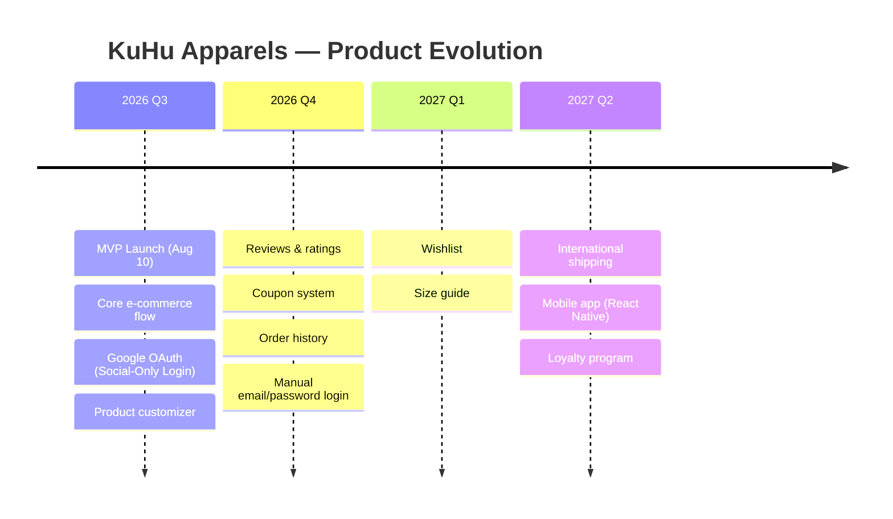

# Project Vision

> **Version:** 1.0  
> **Last Updated:** 5 July 2026  
> **Status:** Draft

---

## Purpose

This document defines the vision, mission, brand identity, and product scope for the KuHu Apparels e-commerce platform. It serves as the north star for all product and technical decisions.

---

## 1. Vision Statement

> **KuHu Apparels: Premium fashion, crafted for the confident individual.**

KuHu Apparels is a direct-to-consumer premium apparel brand that offers high-quality, stylish clothing for men and women. The platform will provide a seamless online shopping experience with product customization capabilities that allow customers to make each piece their own.

---

## 2. Mission

To build a production-grade e-commerce platform that:
- Delivers a premium shopping experience through thoughtful design and reliable technology.
- Enables product customization (upload logos, change colors, resize artwork) directly in the browser.
- Operates with minimal infrastructure cost while maintaining production quality.
- Serves as a learning vehicle for backend engineering best practices.

---

## 3. Brand Identity

### Brand Name
**KuHu Apparels**

### Tagline (TBD)
TODO: Finalize tagline. Options under consideration:
- "Wear Your Statement"
- "Crafted for You"
- "Premium. Personalized. You."

### Brand Personality
- **Premium** — Quality materials, clean design, attention to detail.
- **Confident** — Bold but not loud. Sophisticated but approachable.
- **Modern** — Contemporary designs, digital-first experience.
- **Personal** — Customization as a core feature, not an afterthought.

### Target Audience
- **Age:** 22–40
- **Gender:** Men & Women
- **Income:** Middle to upper-middle class
- **Geography:** India (initial), international (future)
- **Behavior:** Value quality, appreciate personalization, shop online regularly
- **Tech Savvy:** Comfortable with digital payments and online shopping

---

## 4. Product Scope

### MVP Scope (By 10 August 2026)

| Feature | Priority | Complexity |
|---|---|---|
| Product Catalog (2-3 categories, 20-30 products) | P0 | Medium |
| Product Listing with Filters (Category, Size) | P0 | Medium |
| Product Detail Page | P0 | Medium |
| Shopping Cart | P0 | Medium |
| Checkout Flow | P0 | High |
| Razorpay Payment Integration | P0 | High |
| Order Confirmation | P0 | Medium |
| Google OAuth Login (Social-Only) | P0 | Medium |
| User Profile (Name, Email, Avatar) | P0 | Low |
| Email Notifications (Order Confirmation) | P0 | Low |
| Product Customizer (Logo Upload, Color Change) | P0 | High |
| Google Analytics 4 | P0 | Low |
| Responsive Design (Mobile-First) | P0 | Medium |
| Admin Panel (Product & Order Management) | P0 | Low |

### Post-MVP Features

| Feature | Priority | Notes |
|---|---|---|
| Product Reviews & Ratings | P1 | Requires moderation workflow |
| Coupon & Discount System | P1 | Complex validation logic |
| Order History & Tracking | P1 | User-facing order management |
| Multiple Addresses | P1 | Shipping & billing separation |
| Manual Email/Password Login | P2 | Fallback for users without Google accounts |
| Wishlist | P2 | Standard e-commerce feature |
| Size Guide with Measurements | P2 | Reduces returns |
| Advanced Search (Full-text) | P2 | PostgreSQL full-text search |
| Product Variants (Colors, Sizes as SKUs) | P2 | Inventory complexity |
| International Shipping | P3 | Multi-currency, duties |
| Return/Refund Portal | P3 | Self-service returns |

---

## 5. Competitive Landscape

| Brand | Strengths | Weaknesses |
|---|---|---|
| Myntra | Massive catalog, fast delivery | Generic experience, cluttered UI |
| AJIO | Curated collections, good UX | Limited customization |
| Bewakoof | Fun designs, youth focus | Limited premium segment |
| The Souled Store | Pop-culture merch, good customizer | Niche audience |
| **KuHu Apparels (Us)** | Premium focus, deep customization, modern tech | New brand, no customer base |

**Differentiator:** Product customization as a first-class feature — not just print-on-demand, but full design control (colors, logo placement, sizing) with real-time preview.

---

## 6. Success Criteria

### MVP Success Metrics

| Metric | Target |
|---|---|
| Successful checkout flow | 100% of test orders |
| Payment success rate | > 95% |
| Customizer load time | < 3s |
| Email delivery rate | > 99% |
| Lighthouse Performance | > 80 |
| Lighthouse Accessibility | > 85 |
| Mobile responsive | All pages pass 375px–1920px |
| Zero P0/P1 bugs at launch | ✅ |

### Business Metrics (Post-Launch Tracking)

| Metric | Measurement |
|---|---|
| Conversion Rate | Orders / Site Visits |
| Average Order Value | Revenue / Orders |
| Cart Abandonment Rate | Carts Created / Orders Placed |
| Customizer Usage Rate | Sessions with Customizer / Total Sessions |
| Bounce Rate | Single-page sessions / Total Sessions |
| Customer Acquisition Cost | Marketing Spend / New Customers |

---

## 7. Guiding Principles

1. **Quality over quantity.** A small, curated catalog beats 10,000 mediocre products.
2. **Customization is our superpower.** Invest in making the customizer exceptional.
3. **Mobile-first, always.** 70%+ of traffic will come from mobile.
4. **Performance is a feature.** Every millisecond matters for conversion.
5. **Security is non-negotiable.** Payment data, user data, and business data must be protected.
6. **Learn in public.** Document decisions, write about challenges, share knowledge.

---

## 8. Future Evolution

## 9. Open Questions

- [ ] Should we offer Apple ID as a secondary social login provider?
- [ ] Should we offer pre-orders for new collections?
- [ ] What is the return policy window? (14 days? 30 days?)
- [ ] Do we need a size recommendation engine?
- [ ] Should customization increase the product price?
- [ ] What is the minimum order value for free shipping?

## 10. References

- [Project Context](../PROJECT_CONTEXT.md) — Constraints, goals, technology decisions
- [Roadmap](./02_Roadmap.md) — Weekly milestones
- [UI Design Bible](./04_UI_Design_Bible.md) — Brand visual identity
- [Architecture Decisions](./03_Architecture_Decisions.md) — Technical decision records

---

*This document should be reviewed and updated as the product evolves.*
