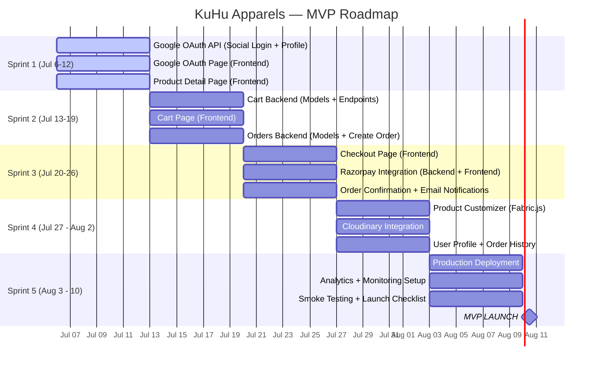

# Roadmap

> **Version:** 1.0  
> **Last Updated:** 5 July 2026  
> **Target MVP Launch:** 10 August 2026

---

## Purpose

This document outlines the weekly development roadmap from project inception to MVP launch. Each week has clear deliverables across backend, frontend, deployment, and design.

---

## 1. Timeline Overview

---

## 2. Weekly Breakdown

### Sprint 1: Foundation & Auth (6 July — 12 July)

**Theme:** Get users in the door.

#### Backend Goals

| Task | Details | Status |
|---|---|---|
| Google OAuth Integration | `django-allauth` setup, Google provider config | ⏳ |
| Google Login API | `POST /api/auth/google/` — receive Google token, create/login user | ⏳ |
| JWT Token Generation | Issue JWT after Google OAuth success | ⏳ |
| Token Refresh API | `POST /api/auth/token/refresh/` | ⏳ |
| Profile API | `GET/PATCH /api/auth/me/` — name, email, avatar from Google | ⏳ |
| Address Model & CRUD | `GET/POST/PUT/DELETE /api/addresses/` | ❌ |
| Product Admin Enhancements | Staff CRUD endpoints for products | ⏳ |

#### Frontend Goals

| Task | Details | Status |
|---|---|---|
| Google Sign-In Button | Integrate Google Identity Services (GIS) one-tap / button | ❌ |
| Post-Login Redirect | Handle OAuth callback, exchange code for token | ❌ |
| Auth State Management | Zustand store for user/token, Axios interceptor | ❌ |
| Protected Routes | Redirect to Google login if unauthenticated | ❌ |
| Product Detail Page | Fetch and display single product with all info | ❌ |
| Navigation | Header with auth-aware links (avatar, logout) | ❌ |

#### Design Goals

| Task | Details |
|---|---|
| Finalize color palette | Dark green + gold/cream |
| Design Google Sign-In page | Branded Google button, clean layout |
| Design PDP layout | Image gallery, size selector, add-to-cart |

#### Deployment Goals

| Task | Details |
|---|---|
| Set up Neon PostgreSQL database | Create project, get connection string |
| Initial Railway deployment | Deploy backend with Django |
| Initial Vercel deployment | Deploy frontend |
| Configure environment variables | Document all required vars |
| Set up Cloudinary account | Media storage for product images |

---

### Sprint 2: Cart & Orders (13 July — 19 July)

**Theme:** Let users add items and prepare to buy.

#### Backend Goals

| Task | Details | Status |
|---|---|---|
| Cart Model | Cart + CartItem models | ❌ |
| Add to Cart | `POST /api/cart/items/` | ❌ |
| View Cart | `GET /api/cart/` | ❌ |
| Update Cart Item | `PATCH /api/cart/items/:id/` | ❌ |
| Remove Cart Item | `DELETE /api/cart/items/:id/` | ❌ |
| Guest Cart Support | session_id-based cart for non-logged-in users | ❌ |
| Cart Merge on OAuth Login | Merge guest cart into user cart on Google sign-in | ❌ |
| Order Model | Order + OrderItem models, status choices | ❌ |
| Create Order from Cart | `POST /api/orders/` with stock decrement | ❌ |

#### Frontend Goals

| Task | Details |
|---|---|
| Cart Page | List cart items, quantities, totals |
| Add to Cart Button | PDP integration |
| Cart Icon with Badge | Header indicator |
| Cart Quantity Controls | Increment/decrement inline |

#### Design Goals

| Task | Details |
|---|---|
| Design cart page layout | Desktop + mobile |
| Design cart item component | Image, name, size, qty, price, remove |
| Design empty cart state | Illustration + CTA |

#### Deployment Goals

| Task | Details |
|---|---|
| Set up Resend account | Email API for order notifications |
| Configure Django email backend | SMTP via Resend |

---

### Sprint 3: Checkout & Payments (20 July — 26 July)

**Theme:** Complete the purchase.

#### Backend Goals

| Task | Details | Status |
|---|---|---|
| Order Detail API | `GET /api/orders/:id/` | ❌ |
| Order List API | `GET /api/orders/` (user's orders) | ❌ |
| Razorpay Order Creation | `POST /api/payments/create-order/` | ❌ |
| Razorpay Webhook Handler | Verify + update order status | ❌ |
| Order Confirmation Email | Trigger via Resend after payment | ❌ |
| Stock Management | Decrement on order, restore on cancel | ❌ |

#### Frontend Goals

| Task | Details |
|---|---|
| Checkout Page | Address form, order summary, pay button |
| Razorpay Checkout Integration | Load Razorpay SDK, handle response |
| Order Confirmation Page | Success message, order details |
| Order History Page | List of past orders |
| Loading States | Skeleton loaders for all pages |
| Error Handling | Payment failure screens, retry logic |

#### Design Goals

| Task | Details |
|---|---|
| Design checkout page layout | Summary sidebar, form |
| Design order confirmation page | Success animation, order details |
| Design order history page | Table/list of orders |

---

### Sprint 4: Customization & Profile (27 July — 2 August)

**Theme:** Make it personal.

#### Backend Goals

| Task | Details | Status |
|---|---|---|
| Design Save/Load API | `POST /api/customizations/` — save design JSON | ❌ |
| Customization Model | ProductCustomization (user, product, design_json, preview_image) | ❌ |
| Image Upload Endpoint | `POST /api/uploads/` — upload to Cloudinary | ❌ |
| Order Status Endpoints | Cancel order | ❌ |

#### Frontend Goals

| Task | Details |
|---|---|
| Product Customizer Page | Fabric.js canvas |
| Logo Upload | File picker → canvas overlay |
| Color Changer | Select shirt color, update canvas |
| Logo Color Changer | Pick color for uploaded logo |
| Move/Resize/Rotate | Fabric.js interaction controls |
| Save Design | POST design JSON to backend |
| Preview | Realistic product mockup with design applied |
| User Profile Page | View/edit name, email, addresses |
| Add/Edit Addresses | Form modal or page |

#### Design Goals

| Task | Details |
|---|---|
| Design customizer layout | Canvas + toolbar + controls |
| Design color picker component | Swatch-based, preset colors |
| Design preview mockup template | Product image overlay |

---

### Sprint 5: Launch Prep (3 August — 10 August)

**Theme:** Ship it.

#### Backend Goals

| Task | Details | Status |
|---|---|---|
| Performance Optimization | Add `select_related`/`prefetch_related`, indexing | ❌ |
| Security Audit | CSRF, CORS, rate limiting, input validation | ❌ |
| Error Tracking Setup | Sentry integration (or basic logging) | ❌ |

#### Frontend Goals

| Task | Details |
|---|---|
| SEO Setup | Meta tags, Open Graph, sitemap, robots.txt |
| PWA Setup (Basic) | Manifest.json, offline fallback |
| Performance Optimization | Lazy loading, image optimization, bundle analysis |
| 404 Page | Custom not-found page |
| Loading States Audit | All pages have loading skeletons |
| Error Boundaries | React error boundaries across routes |
| Responsive Testing | Test all pages at 375px, 768px, 1024px, 1440px |

#### Deployment Goals

| Task | Details |
|---|---|
| Production Railway Deploy | Finalize backend deployment |
| Production Vercel Deploy | Finalize frontend deployment |
| Custom Domain Setup | DNS configuration (if applicable) |
| SSL Certificate Verification | Ensure HTTPS works |
| GA4 Setup | Property created, tracking code installed |
| Database Backup Strategy | Automated backups configured |

#### Launch Prep

| Task | Details |
|---|---|
| Smoke Test | Full purchase flow test |
| Payment Test | Razorpay test mode → successful payment |
| Email Test | Order confirmation email delivery |
| Mobile Test | Test on actual mobile devices |
| Launch Checklist | Complete [Launch Checklist](./07_Launch_Checklist.md) |
| 🚀 **MVP Launch** | **10 August 2026** |

---

## 3. Risk Register

| Risk | Probability | Impact | Mitigation |
|---|---|---|---|
| Customizer (Fabric.js) more complex than expected | Medium | High | Start early (Sprint 4), build MVP version first |
| Razorpay integration issues | Low | High | Use test mode extensively, document webhook flow |
| Deployment configuration problems | Medium | Medium | Deploy early (Sprint 1), iterate |
| Scope creep | High | High | Strictly follow roadmap, defer non-MVP features |
| Learning curve slows backend work | Medium | Medium | Start with proven patterns, lean on Django documentation |
| Payment webhook failures | Low | Critical | Log all webhooks, manual reconciliation process |

---

## 4. Buffer & Contingency

- **Sprint 1-4 buffer:** Each sprint has 1-2 days of buffer built in for unexpected issues.
- **Sprint 5 buffer:** Full week for launch prep, testing, and fixes.
- **Post-Sprint 5 buffer:** 1 week post-launch for critical bug fixes.

## 5. Open Questions

- [ ] Should we add a buffer sprint (6) between now and launch?
- [ ] What is the escalation path for blocking issues?
- [ ] Should we have a beta period before public launch?

## 6. References

- [Project Vision](./01_Project_Vision.md) — Product scope & priorities
- [Project Context](../PROJECT_CONTEXT.md) — Constraints & goals
- [Architecture Decisions](./03_Architecture_Decisions.md) — Technical decisions
- [Launch Checklist](./07_Launch_Checklist.md) — Pre-launch verification

---

*This roadmap is a living document. Update as priorities shift and new information emerges.*
