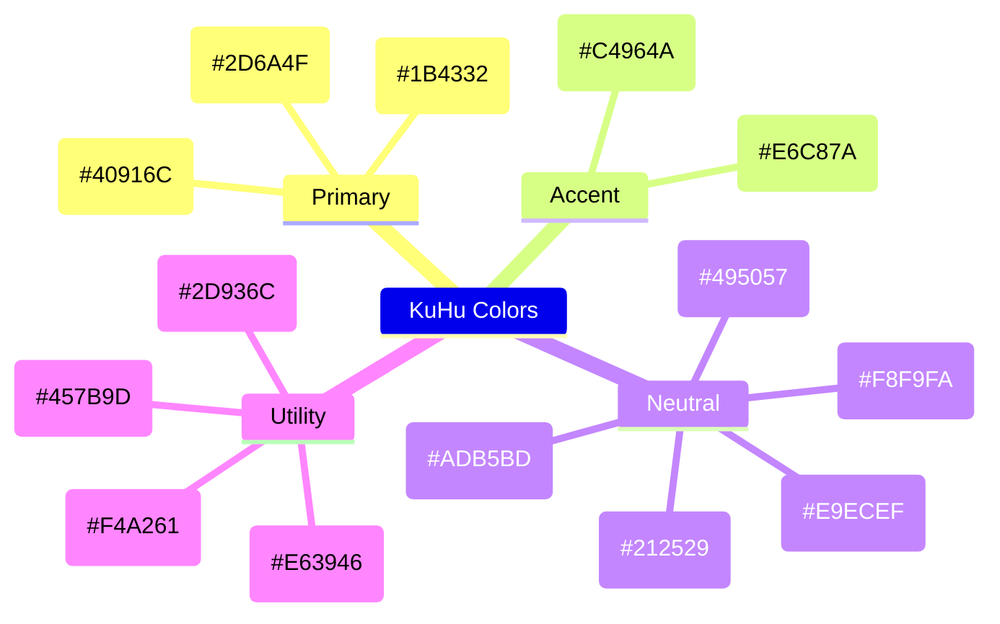
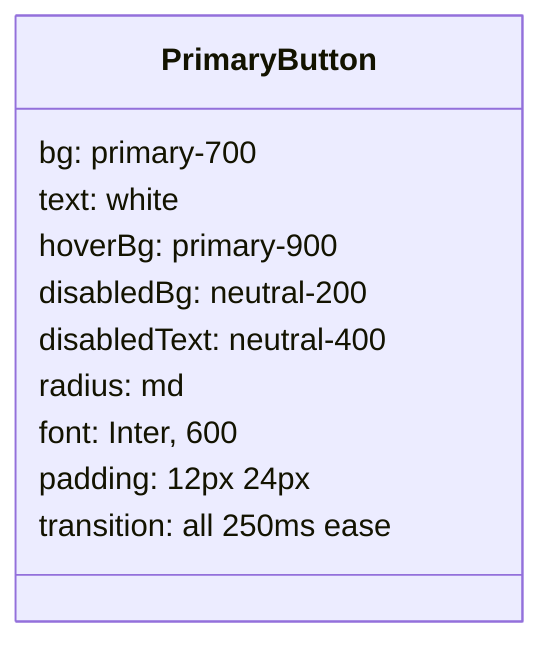

# UI Design Bible

> **Version:** 1.0  
> **Last Updated:** 5 July 2026  
> **Status:** Draft — Visual refinements ongoing

---

## Purpose

This document defines the complete design system for KuHu Apparels. It serves as the single source of truth for visual identity, design tokens, component specifications, layout guidelines, and interaction patterns. Every UI decision should trace back to this document.

---

## Table of Contents

1. [Brand Identity](#1-brand-identity)
2. [Color Palette](#2-color-palette)
3. [Typography](#3-typography)
4. [Spacing](#4-spacing)
5. [Border Radius](#5-border-radius)
6. [Elevation](#6-elevation)
7. [Design Tokens Summary](#7-design-tokens-summary)
8. [Buttons](#8-buttons)
9. [Inputs & Forms](#9-inputs--forms)
10. [Cards](#10-cards)
11. [Tables](#11-tables)
12. [Navigation](#12-navigation)
13. [Product Cards](#13-product-cards)
14. [Filters](#14-filters)
15. [Header](#15-header)
16. [Footer](#16-footer)
17. [Homepage Layout](#17-homepage-layout)
18. [Product Listing Page (PLP)](#18-product-listing-page-plp)
19. [Product Detail Page (PDP)](#19-product-detail-page-pdp)
20. [Cart Page](#20-cart-page)
21. [Checkout Page](#21-checkout-page)
22. [Customizer Page](#22-customizer-page)
23. [Responsive Rules](#23-responsive-rules)
24. [Animations](#24-animations)
25. [Accessibility](#25-accessibility)
26. [Image Guidelines](#26-image-guidelines)
27. [Icons](#27-icons)
28. [Tailwind CSS Mapping](#28-tailwind-css-mapping)

---

## 1. Brand Identity

### Brand Essence

KuHu Apparels is **premium, confident, modern, and personal**. The visual identity should communicate quality without being flashy, sophistication without being cold.

### Design Principles

| Principle | Description |
|---|---|
| **Clean & Minimal** | Ample whitespace, clear hierarchy, no visual clutter |
| **Premium Feel** | High-quality imagery, refined color palette, thoughtful details |
| **Confident Typography** | Bold headings, readable body text |
| **Personal Touch** | Warmth in interactions, human-centered design |

### Mood Board Descriptors

- Minimalist
- Warm premium
- Earth tones with gold accents
- Clean sans-serif
- High-quality product photography
- Generous whitespace

---

## 2. Color Palette

### Primary Palette



#### Detailed Swatches

| Token | Hex | RGB | Usage |
|---|---|---|---|
| `--color-primary-900` | `#1B4332` | `27, 67, 50` | Headings, primary backgrounds |
| `--color-primary-700` | `#2D6A4F` | `45, 106, 79` | Buttons, links, active states |
| `--color-primary-500` | `#40916C` | `64, 145, 108` | Hover states, secondary elements |
| `--color-primary-300` | `#95D5B2` | `149, 213, 178` | Borders, subtle backgrounds |
| `--color-primary-100` | `#D8F3DC` | `216, 243, 220` | Very subtle backgrounds |

| Token | Hex | RGB | Usage |
|---|---|---|---|
| `--color-accent-700` | `#C4964A` | `196, 150, 74` | Price highlights, badges, CTAs |
| `--color-accent-500` | `#E6C87A` | `230, 200, 122` | Hover states on accent elements |

| Token | Hex | RGB | Usage |
|---|---|---|---|
| `--color-neutral-100` | `#F8F9FA` | `248, 249, 250` | Page background |
| `--color-neutral-200` | `#E9ECEF` | `233, 236, 239` | Card backgrounds, dividers |
| `--color-neutral-400` | `#ADB5BD` | `173, 181, 189` | Disabled text, placeholders |
| `--color-neutral-600` | `#495057` | `73, 80, 87` | Secondary text |
| `--color-neutral-900` | `#212529` | `33, 37, 41` | Primary text |

| Token | Hex | Usage |
|---|---|---|
| `--color-success` | `#2D936C` | Success messages, in-stock |
| `--color-error` | `#E63946` | Error messages, out-of-stock |
| `--color-warning` | `#F4A261` | Warnings, low stock |
| `--color-info` | `#457B9D` | Information, tooltips |

### Color Usage Rules

- **Do not** use pure black (`#000000`) for text. Use `--color-neutral-900` (`#212529`).
- **Do not** use pure white (`#FFFFFF`) for backgrounds. Use `--color-neutral-100` (`#F8F9FA`).
- **Accent color** should be used sparingly — for prices, badges, and key CTAs.
- **Primary green** is the hero color — used for main actions, header, footer.
- Ensure minimum contrast ratio of **4.5:1** for normal text, **3:1** for large text (WCAG AA).

---

## 3. Typography

### Font Family

| Usage | Font | Fallback |
|---|---|---|
| Headings | `Playfair Display` | `Georgia, serif` |
| Body | `Inter` | `-apple-system, BlinkMacSystemFont, sans-serif` |
| Mono (code) | `JetBrains Mono` | `monospace` |

### Font Loading Strategy

```mermaid
flowchart LR
    A[Preload fonts in <head>] --> B[Swap display: swap]
    B --> C[FOUT (Flash of Unstyled Text)]
    C --> D[Fonts loaded → styled text]
```

- Use `font-display: swap` to ensure text remains visible during font load.
- Preload `Playfair Display` (headings) as it's critical for above-the-fold content.
- Load `Inter` (body) with `font-display: swap` — text is readable with fallback.
- Subset fonts to Latin characters only to reduce file size.

### Type Scale

| Level | Size | Weight | Line Height | Letter Spacing | Font |
|---|---|---|---|---|---|
| **Display** | `4xl` — 3rem (48px) | Bold (700) | 1.1 | -0.02em | Playfair Display |
| **H1** | `3xl` — 2.25rem (36px) | Bold (700) | 1.2 | -0.02em | Playfair Display |
| **H2** | `2xl` — 1.5rem (24px) | Bold (700) | 1.3 | -0.01em | Playfair Display |
| **H3** | `xl` — 1.25rem (20px) | Semibold (600) | 1.4 | 0 | Inter |
| **H4** | `lg` — 1.125rem (18px) | Semibold (600) | 1.4 | 0 | Inter |
| **Body Large** | `lg` — 1.125rem (18px) | Regular (400) | 1.6 | 0 | Inter |
| **Body** | `base` — 1rem (16px) | Regular (400) | 1.6 | 0 | Inter |
| **Body Small** | `sm` — 0.875rem (14px) | Regular (400) | 1.5 | 0 | Inter |
| **Caption** | `xs` — 0.75rem (12px) | Regular (400) | 1.4 | 0.01em | Inter |
| **Price** | `xl` — 1.25rem (20px) | Bold (700) | 1.3 | 0 | Inter |

### Responsive Type Scale

| Level | Mobile | Tablet | Desktop |
|---|---|---|---|
| Display | 2rem (32px) | 2.5rem (40px) | 3rem (48px) |
| H1 | 1.75rem (28px) | 2rem (32px) | 2.25rem (36px) |
| H2 | 1.25rem (20px) | 1.375rem (22px) | 1.5rem (24px) |
| Body | 0.938rem (15px) | 1rem (16px) | 1rem (16px) |

### Typography Rules

- Maximum line length for readability: **65-75 characters** per line.
- Heading to body spacing: `1.5rem` (24px).
- Paragraph spacing: `1rem` (16px).
- Do not justify text.
- Do not use italic for long passages — reserve for captions and quotes.
- Links in body text should be underlined.

---

## 4. Spacing

### Spacing Scale (Tailwind Compatible)

| Token | Size | Rem | PX | Usage |
|---|---|---|---|---|
| `space-0` | 0 | 0 | 0 | None |
| `space-1` | `px` | 0.0625 | 1 | Borders, dividers |
| `space-2` | `0.5` | 0.5 | 8 | Tight padding (badges, tags) |
| `space-3` | `3` | 0.75 | 12 | Tight spacing (icon + text) |
| `space-4` | `4` | 1 | 16 | Default padding (cards, buttons) |
| `space-5` | `5` | 1.25 | 20 | Section padding |
| `space-6` | `6` | 1.5 | 24 | Card padding, section spacing |
| `space-8` | `8` | 2 | 32 | Section spacing |
| `space-10` | `10` | 2.5 | 40 | Page section gaps |
| `space-12` | `12` | 3 | 48 | Major sections |
| `space-16` | `16` | 4 | 64 | Page padding |
| `space-20` | `20` | 5 | 80 | Hero section padding |
| `space-24` | `24` | 6 | 96 | Full section spacing |

### Spacing Rules

- Use multiples of `space-4` (16px) for consistent rhythm.
- Component padding: `space-6` (24px) for cards, `space-4` (16px) for mobile.
- Section spacing: minimum `space-12` (48px) between major sections.
- Grid gap: `space-4` (16px) mobile, `space-6` (24px) desktop.

---

## 5. Border Radius

| Token | Value | Usage |
|---|---|---|
| `radius-none` | 0 | Sharp edges (tables, headers) |
| `radius-sm` | 4px | Inputs, buttons small |
| `radius-md` | 8px | Cards, buttons, modals |
| `radius-lg` | 12px | Large cards, containers |
| `radius-xl` | 16px | Dialogs, sheets |
| `radius-full` | 9999px | Avatars, badges, pills |

---

## 6. Elevation

### Shadow Tokens

| Token | Value | Usage |
|---|---|---|
| `shadow-sm` | `0 1px 2px rgba(0,0,0,0.05)` | Subtle separation (cards) |
| `shadow-md` | `0 4px 6px rgba(0,0,0,0.07)` | Moderate (dropdowns, hover) |
| `shadow-lg` | `0 10px 15px rgba(0,0,0,0.1)` | High (modals, sheets) |
| `shadow-xl` | `0 20px 25px rgba(0,0,0,0.15)` | Maximum (toasts, dialogs) |

### Usage Rules

- Use `shadow-sm` as the default card elevation.
- Elevate on hover/interaction: card hover → `shadow-md`.
- Modals and dropdowns: `shadow-lg` or `shadow-xl`.
- Avoid elevation on text-heavy content (readability concern).

---

## 7. Design Tokens Summary

```css
:root {
  /* Colors */
  --color-primary-900: #1B4332;
  --color-primary-700: #2D6A4F;
  --color-primary-500: #40916C;
  --color-primary-300: #95D5B2;
  --color-primary-100: #D8F3DC;
  
  --color-accent-700: #C4964A;
  --color-accent-500: #E6C87A;
  
  --color-neutral-100: #F8F9FA;
  --color-neutral-200: #E9ECEF;
  --color-neutral-400: #ADB5BD;
  --color-neutral-600: #495057;
  --color-neutral-900: #212529;
  
  --color-success: #2D936C;
  --color-error: #E63946;
  --color-warning: #F4A261;
  --color-info: #457B9D;

  /* Typography */
  --font-heading: 'Playfair Display', Georgia, serif;
  --font-body: 'Inter', -apple-system, BlinkMacSystemFont, sans-serif;
  --font-mono: 'JetBrains Mono', monospace;

  /* Spacing */
  --space-1: 0.25rem;
  --space-2: 0.5rem;
  --space-3: 0.75rem;
  --space-4: 1rem;
  --space-6: 1.5rem;
  --space-8: 2rem;
  --space-12: 3rem;
  --space-16: 4rem;
  --space-20: 5rem;

  /* Radius */
  --radius-sm: 4px;
  --radius-md: 8px;
  --radius-lg: 12px;
  --radius-xl: 16px;
  --radius-full: 9999px;

  /* Shadows */
  --shadow-sm: 0 1px 2px rgba(0,0,0,0.05);
  --shadow-md: 0 4px 6px rgba(0,0,0,0.07);
  --shadow-lg: 0 10px 15px rgba(0,0,0,0.1);
  --shadow-xl: 0 20px 25px rgba(0,0,0,0.15);

  /* Transitions */
  --transition-fast: 150ms ease;
  --transition-base: 250ms ease;
  --transition-slow: 400ms ease;
}
```

---

## 8. Buttons

### Button Hierarchy

| Level | Use Case | Style |
|---|---|---|
| **Primary** | Main CTA (Add to Cart, Checkout, Save) | Filled `primary-700`, white text |
| **Secondary** | Alternative action (Continue Shopping) | Outlined `primary-700` |
| **Tertiary** | Subtle action (Cancel, Remove) | Text only, `neutral-600` |
| **Danger** | Destructive action (Delete) | Filled `error` |

### Primary Button



| State | Background | Text | Border |
|---|---|---|---|
| Default | `primary-700` (`#2D6A4F`) | White | None |
| Hover | `primary-900` (`#1B4332`) | White | None |
| Active | `primary-900` | White | None |
| Disabled | `neutral-200` (`#E9ECEF`) | `neutral-400` (`#ADB5BD`) | None |
| Loading | `primary-700` | White + spinner | None |

### Button Sizes

| Size | Padding | Font Size | Icon Size |
|---|---|---|---|
| Small (`sm`) | 8px 16px | 0.875rem (14px) | 16px |
| Default (`md`) | 12px 24px | 1rem (16px) | 20px |
| Large (`lg`) | 16px 32px | 1.125rem (18px) | 24px |
| Full width | 12px 24px | 1rem (16px) | 20px |

### Button States Checklist

- [x] Default
- [x] Hover (darken bg by 10%)
- [x] Active/Pressed (darken by 15%)
- [x] Focus (2px outline, `primary-300`)
- [x] Disabled (no pointer events, reduced opacity)
- [x] Loading (spinner, disabled)
- [x] Full width variant
- [x] Icon + text variant
- [x] Icon only variant (with tooltip)

---

## 9. Inputs & Forms

### Text Input

| State | Border | Background | Text |
|---|---|---|---|
| Default | `neutral-300` 1px | White | `neutral-900` |
| Hover | `primary-300` 1px | White | `neutral-900` |
| Focus | `primary-500` 2px | White | `neutral-900` |
| Error | `error` 1px | `error` + 5% opacity | `neutral-900` |
| Disabled | `neutral-200` | `neutral-100` | `neutral-400` |
| Read-only | `neutral-200` dashed | `neutral-100` | `neutral-600` |

### Input Sizes

| Size | Padding | Font Size | Height |
|---|---|---|---|
| Small | 8px 12px | 0.875rem | 36px |
| Default | 12px 16px | 1rem | 44px |
| Large | 16px 20px | 1.125rem | 52px |

### Form Elements Checklist

- [x] Text input
- [x] Email input (with type validation)
- [x] Password input (with show/hide toggle)
- [x] Search input (with icon, clear button)
- [x] Textarea (with resize handle)
- [x] Select dropdown (custom styled)
- [x] Checkbox (custom styled)
- [x] Radio button (custom styled)
- [x] Toggle/Switch
- [x] File upload (drag-and-drop zone)
- [x] Color picker (swatch-based for product options)

### Form Layout Rules

- Labels above inputs (not inline) for readability.
- Helper text below input (`sm`, `neutral-600`).
- Error message below input (`sm`, `error`, with icon).
- Required fields marked with `*` in `error` color.
- Group related fields with fieldset and legend.
- Submit button aligned to the left on mobile, right on desktop.

---

## 10. Cards

### Card Specification

| Property | Value |
|---|---|
| Background | White |
| Border | 1px `neutral-200` |
| Radius | `md` (8px) |
| Padding | `space-6` (24px) |
| Shadow | `shadow-sm` |
| Hover | `shadow-md` transition |
| Content spacing | `space-4` (16px) |

### Card Variants

| Variant | Use | Changes |
|---|---|---|
| **Default** | Generic content container | As above |
| **Clickable** | Product card, link card | Hover: `shadow-md`, cursor pointer |
| **Elevated** | Featured content | `shadow-md` default, `shadow-lg` hover |
| **Bordered** | Section of a form | No shadow, border only |
| **Flat** | Nested content | No shadow, no border, `neutral-100` bg |

---

## 11. Tables

⚠️ **TODO:** Tables are not in MVP scope. This section will be expanded when order management and admin tables are designed.

### Basic Rules

- Header row: `neutral-100` background, `semibold` weight.
- Alternating row colors for readability.
- Responsive: horizontal scroll on mobile OR convert to cards.
- Sortable column headers indicated with arrows.
- Action column right-aligned.

---

## 12. Navigation

### Primary Navigation

- **Sticky header** on scroll (mobile and desktop).
- **Mobile:** Hamburger menu → slide-out drawer (left).
- **Desktop:** Horizontal nav with dropdown menus.
- Active page indicated with underline or `primary-700` text.
- Current: `primary-700` weight `600`.

### Navigation Items (Order)

1. **Home** (Logo + link)
2. **Men** → Categories
3. **Women** → Categories
4. **Customize** (Customizer page)
5. **Search** (Icon → expandable input)
6. **Account** (Icon → dropdown: Login/Register or Profile/Orders)
7. **Cart** (Icon + badge count)

### Breadcrumbs

- Separator: `/`
- Current page: `neutral-900`, `semibold`
- Parent pages: `neutral-600`, clickable
- Home is always first

---

## 13. Product Cards

### Product Card Layout (Grid)

```
┌────────────────────────────────┐
│                                │
│         Product Image          │
│         (4:5 Aspect)           │
│                                │
├────────────────────────────────┤
│  Category Tag         Favorite │
│                                │
│  Product Name                  │
│  (2 lines max)                │
│                                │
│  ₹ 1,499                       │
│  ~~ ₹ 1,999 ~~  -25%          │
│                                │
│  Color Options (3)            │
│                                │
│  [ Add to Cart ]              │
└────────────────────────────────┘
```

### Product Card Specs

| Element | Style |
|---|---|
| Image | 4:5 aspect ratio, `object-cover`, lazy loaded |
| Category tag | `xs`, uppercase, `neutral-400` |
| Name | `sm`/`base`, `semibold`, max 2 lines, line-clamp |
| Price (current) | `base`/`lg`, `bold`, `primary-700` |
| Price (compare) | `sm`, `neutral-400`, line-through |
| Discount badge | `xs`, `error` text, `error` + 10% bg, pill |
| Color swatches | `space-3` circles, bordered white on hover |
| Add to Cart | Full width, `sm` primary button |
| Favorite | Heart icon, `neutral-400`, `error` when active |

### Grid Behavior

| Breakpoint | Columns | Gap |
|---|---|---|
| Mobile (< 640px) | 2 | 12px |
| Tablet (640-1024px) | 3 | 16px |
| Desktop (> 1024px) | 4 | 24px |

---

## 14. Filters

### Filter Types

| Filter | Type | Behavior |
|---|---|---|
| Category | Checkbox list | Multiple select, logical AND |
| Size | Button group | Multiple select (Pill buttons) |
| Price Range | Range slider or min/max inputs | Debounced (300ms) |
| Color | Swatch grid | Single select |
| Sort By | Select dropdown | Re-fetches sorted results |

### Filter Layout

- **Desktop:** Left sidebar, sticky on scroll.
- **Mobile:** Slide-out drawer from left (same as nav), toggle with filter icon.
- Active filters shown as removable pills above product grid.
- "Clear All" link at top of filter section.

### Active Filters Pills

```
[  Men  ✕ ]  [  XL  ✕ ]  [  ₹500-₹1500  ✕ ]  [ Clear All ]
```

- Pill: `neutral-100` bg, `sm`, `neutral-900` text, `✕` icon.
- Click `✕` to remove individual filter.
- "Clear All" is a text link, `sm`, `primary-700`.

---

## 15. Header

### Layout

```
┌──────────────────────────────────────────────────┐
│  [☰]  KuHu   Men  Women  Customize  [🔍] [👤] [🛒3]│  ← Mobile
│  KuHu  [Men ▼] [Women ▼]  Customize  🔍  👤  🛒3  │  ← Desktop
└──────────────────────────────────────────────────┘
```

### Header Specs

| Property | Value |
|---|---|
| Height (mobile) | 56px |
| Height (desktop) | 72px |
| Background | White, 95% opacity (backdrop blur) |
| Border bottom | 1px `neutral-200` |
| Z-index | 50 |
| Position | Fixed top |

### Mobile Header Behavior

- Logo centered.
- Hamburger left.
- Icons (search, account, cart) right.
- Cart badge: `primary-700` bg, white text, `xs`, centered on icon.

### Desktop Header Behavior

- Logo left.
- Navigation center.
- Icons right.
- Dropdown menus on hover (Men, Women).
- Search icon → expands to full input on click.

---

## 16. Footer

### Layout

```
┌──────────────────────────────────────────────────┐
│                                                   │
│  KuHu Apparels                                    │
│  Premium fashion, crafted for you.                │
│                                                   │
│  ┌─────────┐ ┌─────────┐ ┌─────────┐ ┌────────┐ │
│  │ Shop     │ │ Support │ │ Company │ │ Follow │ │
│  │ Men      │ │ FAQ      │ │ About   │ │ IG     │ │
│  │ Women    │ │ Shipping │ │ Contact │ │ FB     │ │
│  │ Customize│ │ Returns  │ │         │ │ X      │ │
│  └─────────┘ └─────────┘ └─────────┘ └────────┘ │
│                                                   │
│  ─────────────────────────────────────────────────│
│                                                   │
│  © 2026 KuHu Apparels. All rights reserved.       │
│  Privacy  ·  Terms  ·  Accessibility              │
└──────────────────────────────────────────────────┘
```

### Footer Specs

| Property | Value |
|---|---|
| Background | `primary-900` (`#1B4332`) |
| Text | White / `primary-300` |
| Padding | `space-12` top/bottom |
| Layout | 4 columns (desktop), stacked (mobile) |

---

## 17. Homepage Layout

### Section Order

1. **Hero Banner** — Full-width, high-quality lifestyle image, tagline, CTA button
2. **Featured Categories** — 2-3 category cards (Men, Women, Customize)
3. **New Arrivals** — Product grid (4-8 products)
4. **Customization Teaser** — Section promoting the customizer with mockup
5. **Newsletter Signup** — Email input + CTA (minimal version)
6. **Footer**

### Hero Banner

| Property | Value |
|---|---|
| Height (mobile) | 70vh |
| Height (desktop) | 80vh |
| Image | Full-bleed, `object-cover`, dark overlay (gradient) |
| Text overlay | Centered, white, Display + Body + Button |
| CTA | Primary button (white outline or filled accent) |

---

## 18. Product Listing Page (PLP)

### Layout

```
┌──────────────────────────────────────────────────┐
│  Home / Men / T-Shirts              Showing 12   │
│                                                   │
│  ┌──────┐  ┌──────┐ ┌──────┐ ┌──────┐           │
│  │Filter│  │Sort: │ │      │ │      │           │
│  │Panel │  │Newest│ │      │ │      │           │
│  │      │  └──────┘ └──────┘ └──────┘           │
│  │[✓] Men│                                        │
│  │[ ]Women│  ┌──────┐ ┌──────┐ ┌──────┐ ┌──────┐│
│  │       │  │      │ │      │ │      │ │      ││
│  │Sizes  │  │ Card │ │ Card │ │ Card │ │ Card ││
│  │[S][M] │  │      │ │      │ │      │ │      ││
│  │[L][XL]│  └──────┘ └──────┘ └──────┘ └──────┘│
│  │       │                                        │
│  │Price  │  ┌──────┐ ┌──────┐ ┌──────┐ ┌──────┐│
│  │[Min]  │  │      │ │      │ │      │ │      ││
│  │[Max]  │  │ Card │ │ Card │ │ Card │ │ Card ││
│  └──────┘  │      │ │      │ │      │ │      ││
│            └──────┘ └──────┘ └──────┘ └──────┘│
│                                                   │
│              [  1  2  3  ...  5  ]                │
└──────────────────────────────────────────────────┘
```

### PLP Specs

- **Breadcrumb** at top.
- **Result count** next to breadcrumb.
- **Active filters** as removable pills below breadcrumb.
- **Sort dropdown** top-right of product grid.
- **Product grid** (2 cols mobile, 3 cols tablet, 4 cols desktop).
- **Pagination** at bottom (numbered with prev/next).
- **Empty state:** "No products match your filters" with "Clear Filters" button.

---

## 19. Product Detail Page (PDP)

### Layout

```
┌────────────────────────────────────────────────────┐
│  Home / Men / T-Shirts / Product Name               │
│                                                     │
│  ┌──────────────────┐  ┌────────────────────────┐  │
│  │                   │  │  Product Name           │  │
│  │    Image Gallery  │  │  ★★★★☆  (12 reviews)   │  │
│  │                   │  │                         │  │
│  │  [Main Image]     │  │  ₹ 1,499  ~~₹1,999~~   │  │
│  │                   │  │  -25%                   │  │
│  │  [Thumb][Thumb]   │  │                         │  │
│  │  [Thumb][Thumb]   │  │  Size:                  │  │
│  │                   │  │  [S] [M] [L] [XL]      │  │
│  │                   │  │                         │  │
│  │                   │  │  Color:                 │  │
│  │                   │  │  ⚪ ⚫ 🔵 🔴           │  │
│  │                   │  │                         │  │
│  │                   │  │  Quantity:  [-] 1 [+]   │  │
│  │                   │  │                         │  │
│  │                   │  │  [🛒 Add to Cart]       │  │
│  │                   │  │  [🎨 Customize]         │  │
│  │                   │  │                         │  │
│  │                   │  │  Free shipping on ₹499+ │  │
│  └──────────────────┘  └────────────────────────┘  │
│                                                     │
│  ┌────────────────────────────────────────────┐    │
│  │  Description                               │    │
│  │  ─────────────────────────────────────     │    │
│  │  Product details, material, fit, care...   │    │
│  └────────────────────────────────────────────┘    │
│                                                     │
│  ┌────────────────────────────────────────────┐    │
│  │  You May Also Like (4 products)            │    │
│  └────────────────────────────────────────────┘    │
└────────────────────────────────────────────────────┘
```

### PDP Sections

| Section | Details |
|---|---|
| **Image Gallery** | Main image + 4 thumbnails. Click thumbnail to switch. Pinch-to-zoom on mobile. Hover zoom on desktop. |
| **Product Info** | Name, rating, price with discount, size selector, color selector, quantity, add-to-cart button, customize button. |
| **Description** | Accordion or tabs: Description, Material & Care, Size & Fit, Shipping Info. |
| **Related Products** | Horizontal scroll on mobile, grid on desktop. 4 products from same category. |

### Size Selector

- Pill buttons: `[S] [M] [L] [XL]`
- Available sizes: `primary-700` border, white bg, clickable.
- Unavailable sizes: `neutral-200` bg, `neutral-400` text, line-through, not clickable.
- Selected size: `primary-700` bg, white text.
- Size guide link below selectors.

---

## 20. Cart Page

### Layout

```
┌──────────────────────────────────────────────────┐
│  Shopping Cart (3 items)                         │
│                                                   │
│  ┌────────────────────────────────────────┐      │
│  │  [Image]  Product Name        ₹1,499   │      │
│  │           Size: M  Color: Black        │      │
│  │           Qty: [-] 2 [+]     ₹2,998   │      │
│  │           [Remove]  [Move to Wishlist]│      │
│  ├────────────────────────────────────────┤      │
│  │  [Image]  Product Name          ₹999   │      │
│  │           Size: L  Color: Navy         │      │
│  │           Qty: [-] 1 [+]       ₹999   │      │
│  │           [Remove]  [Move to Wishlist]│      │
│  └────────────────────────────────────────┘      │
│                                                   │
│  ┌──────────────────────┐                         │
│  │  Order Summary        │                         │
│  │  Subtotal:   ₹3,997  │                         │
│  │  Shipping:   ₹49     │                         │
│  │  ──────────────────  │                         │
│  │  Total:      ₹4,046  │                         │
│  │                       │                         │
│  │  [Proceed to Checkout]│                         │
│  │                       │                         │
│  │  [Continue Shopping]  │                         │
│  └──────────────────────┘                         │
│                                                   │
│  [Coupon Code] [Apply]                            │
└──────────────────────────────────────────────────┘
```

### Cart States

| State | Display |
|---|---|
| **Has items** | Cart item list + order summary |
| **Empty** | Illustration + "Your cart is empty" + "Start Shopping" CTA |
| **Loading** | Skeleton rows (3) |
| **Error** | Error message + retry button |

### Quantity Controls

- `[-]` / `[+]` buttons with current quantity displayed center.
- Minimum: 1. Maximum: stock quantity.
- Deleting last item → "Item removed" toast with undo option.

---

## 21. Checkout Page

### Layout

```
┌────────────────────────────────────────────────────┐
│  Checkout                                          │
│                                                     │
│  ┌────────────────────────┐  ┌──────────────────┐  │
│  │  Contact Information   │  │  Order Summary    │  │
│  │  Email *               │  │                   │  │
│  │  [________________]    │  │  [Image] Item x2  │  │
│  │                        │  │  [Image] Item x1  │  │
│  │  Shipping Address      │  │                   │  │
│  │  Full Name *           │  │  Subtotal  ₹3,997 │  │
│  │  [________________]    │  │  Shipping   ₹49   │  │
│  │                        │  │  ───────────────  │  │
│  │  Phone *               │  │  Total     ₹4,046 │  │
│  │  [________________]    │  │                   │  │
│  │                        │  │                   │  │
│  │  Address *             │  │                   │  │
│  │  [________________]    │  │                   │  │
│  │                        │  │                   │  │
│  │  City *     Pincode *  │  │                   │  │
│  │  [______]   [______]   │  │                   │  │
│  │                        │  │                   │  │
│  │  State *               │  │                   │  │
│  │  [Select___________▼]  │  │                   │  │
│  │                        │  │                   │  │
│  │  ────────────────────  │  │                   │  │
│  │                        │  │                   │  │
│  │  Payment Method        │  │                   │  │
│  │  ○ Credit Card         │  │                   │  │
│  │  ○ UPI                 │  │                   │  │
│  │  ○ Net Banking         │  │                   │  │
│  │  ○ Wallet              │  │                   │  │
│  │                        │  │                   │  │
│  │  [Pay ₹4,046]         │  │                   │  │
│  └────────────────────────┘  └──────────────────┘  │
└────────────────────────────────────────────────────┘
```

### Checkout States

| State | Display |
|---|---|
| **Default** | Form with validation |
| **Submitting** | Loading spinner on button, fields disabled |
| **Error** | Field-level errors + toast for API errors |
| **Success** | Redirect to order confirmation |
| **Empty cart** | Redirect to cart page |

### Address Auto-Complete

TODO: Integrate pincode → city/state auto-fill API (PostPIN or similar).

---

## 22. Customizer Page

### Layout

```
┌──────────────────────────────────────────────────────┐
│  Customize Your Product                              │
│                                                       │
│  ┌────────────────────────┐  ┌────────────────────┐  │
│  │                        │  │  Tools              │  │
│  │      Canvas            │  │                     │  │
│  │                        │  │  ┌────────────────┐ │  │
│  │   [Product Preview]    │  │  │ Upload Logo    │ │  │
│  │                        │  │  └────────────────┘ │  │
│  │                        │  │                     │  │
│  │                        │  │  Shirt Color        │  │
│  │                        │  │  ⚪ ⚫ 🔵 🔴 🟢   │  │
│  │                        │  │                     │  │
│  │                        │  │  Logo Color         │  │
│  │                        │  │  ⚪ ⚫ 🔵 🔴 🟡   │  │
│  │                        │  │                     │  │
│  │                        │  │  Size & Position    │  │
│  │                        │  │  [+ Move +]         │  │
│  │                        │  │  [+ Resize +]       │  │
│  │                        │  │  [↻ Rotate]         │  │
│  │                        │  │                     │  │
│  │                        │  │  [Reset]  [Undo]    │  │
│  │                        │  │                     │  │
│  │                        │  │  [💾 Save Design]   │  │
│  │                        │  └────────────────────┘  │
│  └────────────────────────┘                           │
│                                                       │
│  [ ← Back to Product ]       [🛒 Add to Cart]        │
└──────────────────────────────────────────────────────┘
```

### Customizer Features

| Feature | Implementation |
|---|---|
| **Canvas** | Fabric.js with product template as background |
| **Logo Upload** | File input → image appears on canvas. Supported: PNG, SVG, JPG. Max 5MB. |
| **Shirt Color** | Preset color swatches change the product template color (CSS filter or layer swap) |
| **Logo Color** | Fabric.js filter to change logo color (preserves transparency) |
| **Move** | Fabric.js object dragging within bounds |
| **Resize** | Fabric.js corner handles, maintain aspect ratio |
| **Rotate** | Fabric.js rotation handle, snap to 15° increments |
| **Save Design** | Serialize canvas to JSON → POST to backend |
| **Preview** | Generate preview image via Cloudinary or canvas `toDataURL` |
| **Reset** | Clear all customizations, reload initial state |
| **Undo** | Fabric.js state history (last 10 actions) |

### Mobile Customizer

- Canvas takes full viewport height.
- Tools panel is a bottom sheet (draggable).
- Pinch to zoom canvas.
- Touch events for move/resize/rotate.

---

## 23. Responsive Rules

### Breakpoints

| Breakpoint | Width | Device |
|---|---|---|
| `xs` | < 375px | Small phones |
| `sm` | 375-639px | Phones |
| `md` | 640-1023px | Tablets |
| `lg` | 1024-1279px | Small desktop |
| `xl` | 1280-1535px | Desktop |
| `2xl` | ≥ 1536px | Large desktop |

### Layout Adaptation

| Page | Mobile | Tablet | Desktop |
|---|---|---|---|
| Homepage | Stack sections vertically, 2-col grid | Same as mobile, larger type | Hero full-width, multi-col |
| PLP | Filter as drawer, 2 cols | Filter as drawer, 3 cols | Filter sidebar, 4 cols |
| PDP | Stack: image → info → desc | Side-by-side image + info | Side-by-side, wider gallery |
| Cart | Stack: items → summary | Same | Side-by-side |
| Checkout | Stack: form → summary | Same | Side-by-side |
| Customizer | Full canvas + bottom sheet | Canvas + side panel | Canvas + side panel |

### Responsive Checklist

- [x] All pages tested at 375px, 768px, 1024px, 1440px
- [x] Touch targets minimum 44x44px on mobile
- [x] No horizontal scroll on any viewport
- [x] Text is readable without zooming
- [x] Forms are usable with one hand on mobile
- [x] Images are appropriately sized per viewport
- [x] Navigation is accessible via thumb zone on mobile

---

## 24. Animations

### Principles

- **Subtle:** Animations should enhance usability, not distract.
- **Fast:** Keep under 300ms for UI feedback, under 500ms for page transitions.
- **Purposeful:** Every animation should communicate something (state change, navigation, feedback).

### Animation Tokens

```css
:root {
  --ease-out: cubic-bezier(0.16, 1, 0.3, 1);
  --ease-in-out: cubic-bezier(0.65, 0, 0.35, 1);
  --duration-fast: 150ms;
  --duration-base: 250ms;
  --duration-slow: 400ms;
}
```

### Animation Map

| Element | Trigger | Animation | Duration |
|---|---|---|---|
| Button hover | Hover | Background color, subtle scale | 150ms |
| Button click | Click | Scale 0.97 → 1 | 100ms |
| Card hover | Hover | Elevation increase | 250ms |
| Modal/Sidebar | Open | Slide in + fade | 300ms |
| Modal/Sidebar | Close | Slide out + fade | 200ms |
| Toast | Show | Slide down + fade | 300ms |
| Toast | Dismiss | Slide up + fade | 200ms |
| Page transition | Route change | Fade (opacity 0 → 1) | 200ms |
| Product card appear | Scroll | Fade up + scale | 400ms, staggered |
| Add to cart | Click | Badge count increment + bounce | 300ms |
| Skeleton pulse | Loading | Opacity pulse | 1500ms infinite |

### Reduced Motion

- Respect `prefers-reduced-motion: reduce`.
- Disable all non-essential animations.
- Keep: opacity transitions (fade), color changes.
- Remove: scale, translate, rotate, bounce, pulse.

---

## 25. Accessibility

### Standards

- Target: **WCAG 2.1 AA** compliance.
- Screen reader support: **NVDA** (Windows) and **VoiceOver** (macOS/iOS).

### Requirements

#### Color & Contrast

| Element | Contrast Ratio | Standard |
|---|---|---|
| Normal text (< 18px) | ≥ 4.5:1 | AA |
| Large text (≥ 18px bold, ≥ 24px regular) | ≥ 3:1 | AA |
| UI components (borders, icons) | ≥ 3:1 | AA |

#### Keyboard Navigation

- All interactive elements focusable via `Tab`.
- Focus indicator: 2px solid `primary-500` outline, offset 2px.
- Skip to content link (first focusable element).
- Custom tab order where logical (not just DOM order).

#### Screen Reader

- All images have meaningful `alt` text (decorative images: `alt=""`).
- Form inputs have associated `<label>` elements.
- Error messages associated via `aria-describedby`.
- Dynamic content changes announced via `aria-live` regions.
- Custom controls (select, slider) have proper ARIA roles.

#### Semantic HTML

- Use semantic elements: `<nav>`, `<main>`, `<section>`, `<article>`, `<aside>`, `<footer>`.
- Heading hierarchy (h1 → h2 → h3) without skipping levels.
- Use `<button>` for buttons, `<a>` for links.
- Lists marked with `<ul>` / `<ol>`.

### Accessibility Checklist

- [ ] All images have alt text
- [ ] All form inputs have labels
- [ ] Color contrast meets AA minimum
- [ ] Focus indicator visible on all interactive elements
- [ ] Keyboard navigation works through all pages
- [ ] Screen reader can navigate page structure
- [ ] Error messages are announced
- [ ] `prefers-reduced-motion` respected
- [ ] Touch targets ≥ 44x44px on mobile
- [ ] Forms have proper autocomplete attributes

---

## 26. Image Guidelines

### Product Images

| Property | Requirement |
|---|---|
| Format | JPEG (photos), PNG (transparent), WebP (preferred) |
| Resolution | 2000px on longest side minimum |
| Aspect Ratio | 4:5 (portrait) |
| Background | White or transparent |
| File Size | < 500KB after compression |
| Zoom | High-res version at 4000px for zoom feature |

### Image Naming Convention

```
{product-sku}-{variant}-{view}-{index}.webp
```

Example: `tsh-001-blk-front-01.webp`

### Required Views per Product

| View | Required |
|---|---|
| Front | ✅ Yes |
| Back | ✅ Yes |
| Detail (fabric close-up) | Optional |
| Model wearing (lifestyle) | ⭐ Recommended |
| Customized example | ⭐ For customizer promotion |

### Image Optimization

- Upload original to Cloudinary.
- Use Cloudinary transformations for responsive images.
- Serve WebP with JPEG fallback.
- Implement lazy loading (`loading="lazy"`).
- Use `srcset` for responsive image sizes.

### Cloudinary Transformations

| Use Case | Transformation |
|---|---|
| Product card (grid) | `w_400,h_500,c_fill` |
| PDP main image | `w_800,h_1000,c_fill` |
| PDP zoom | `w_1200,h_1500,c_fill` |
| Thumbnail | `w_100,h_125,c_fill` |
| Cart item | `w_80,h_100,c_fill` |
| Hero banner | `w_1920,h_800,c_fill` |

---

## 27. Icons

### Icon Strategy

- Use **Lucide React** icons (open-source, consistent, comprehensive).
- Fallback: SVG inline for custom icons (logo, brand marks).
- Icon size follows type scale: `16px` (sm), `20px` (md), `24px` (lg), `32px` (xl).

### Required Icons

| Icon | Usage |
|---|---|
| `ShoppingCart` | Cart link, cart icon |
| `User` | Account link |
| `Search` | Search toggle |
| `Menu` | Mobile hamburger |
| `X` | Close, remove, dismiss |
| `Heart` | Wishlist/favorite |
| `Star` | Ratings |
| `ChevronDown` | Dropdowns, accordion |
| `ChevronLeft` | Back, previous |
| `ChevronRight` | Forward, next |
| `Plus`, `Minus` | Quantity controls |
| `Trash2` | Remove item |
| `Check` | Success, confirmation |
| `AlertCircle` | Error |
| `Info` | Information |
| `Loader2` | Loading spinner |
| `Package` | Orders |
| `Truck` | Shipping |
| `Shield` | Secure checkout |
| `CreditCard` | Payment |
| `Upload` | Logo upload |
| `RotateCw` | Rotate |
| `Move` | Move |
| `Maximize2` | Resize |
| `Undo2` | Undo |
| `RefreshCw` | Reset |
| `Instagram`, `Facebook`, `Twitter` | Social links |

### Icon Sizes Per Context

| Context | Size |
|---|---|
| Navigation (header) | 24px |
| Buttons (icon only) | 20px |
| Buttons (with text) | 16px |
| Input icons (prefix/suffix) | 16px |
| Toast/Dialog icons | 24px |
| Product card (favorite) | 20px |
| Footer social | 24px |

---

## 28. Tailwind CSS Mapping

### Custom Tailwind Configuration

```js
// tailwind.config.js
module.exports = {
  theme: {
    extend: {
      colors: {
        primary: {
          100: '#D8F3DC',
          300: '#95D5B2',
          500: '#40916C',
          700: '#2D6A4F',
          900: '#1B4332',
        },
        accent: {
          500: '#E6C87A',
          700: '#C4964A',
        },
        neutral: {
          100: '#F8F9FA',
          200: '#E9ECEF',
          400: '#ADB5BD',
          600: '#495057',
          900: '#212529',
        },
        success: '#2D936C',
        error: '#E63946',
        warning: '#F4A261',
        info: '#457B9D',
      },
      fontFamily: {
        heading: ['Playfair Display', 'Georgia', 'serif'],
        body: ['Inter', '-apple-system', 'BlinkMacSystemFont', 'sans-serif'],
        mono: ['JetBrains Mono', 'monospace'],
      },
      spacing: {
        18: '4.5rem',
        30: '7.5rem',
      },
      borderRadius: {
        sm: '4px',
        md: '8px',
        lg: '12px',
        xl: '16px',
      },
      boxShadow: {
        'soft': '0 1px 2px rgba(0,0,0,0.05)',
        'medium': '0 4px 6px rgba(0,0,0,0.07)',
        'strong': '0 10px 15px rgba(0,0,0,0.1)',
        'heavy': '0 20px 25px rgba(0,0,0,0.15)',
      },
      animation: {
        'fade-in': 'fadeIn 200ms ease-out',
        'slide-up': 'slideUp 300ms ease-out',
        'slide-down': 'slideDown 300ms ease-out',
        'scale-in': 'scaleIn 200ms ease-out',
        'pulse-soft': 'pulseSoft 1500ms ease-in-out infinite',
      },
      keyframes: {
        fadeIn: {
          '0%': { opacity: '0' },
          '100%': { opacity: '1' },
        },
        slideUp: {
          '0%': { transform: 'translateY(10px)', opacity: '0' },
          '100%': { transform: 'translateY(0)', opacity: '1' },
        },
        slideDown: {
          '0%': { transform: 'translateY(-10px)', opacity: '0' },
          '100%': { transform: 'translateY(0)', opacity: '1' },
        },
        scaleIn: {
          '0%': { transform: 'scale(0.95)', opacity: '0' },
          '100%': { transform: 'scale(1)', opacity: '1' },
        },
        pulseSoft: {
          '0%, 100%': { opacity: '1' },
          '50%': { opacity: '0.5' },
        },
      },
    },
  },
};
```

### Common Class Patterns

| Component | Tailwind Classes |
|---|---|
| Product card | `bg-white rounded-md shadow-soft hover:shadow-medium transition-shadow duration-250` |
| Primary button | `bg-primary-700 text-white px-6 py-3 rounded-md font-semibold hover:bg-primary-900 transition-colors duration-150` |
| Text input | `w-full px-4 py-3 border border-neutral-300 rounded-md focus:border-primary-500 focus:ring-2 focus:ring-primary-300 outline-none` |
| Section container | `max-w-7xl mx-auto px-4 sm:px-6 lg:px-8 py-12 lg:py-16` |
| Page heading | `font-heading text-h1 text-neutral-900 mb-6` |
| Breadcrumb | `text-sm text-neutral-600 [&>span]:text-neutral-900 [&>span]:font-semibold` |

---

## Appendix: Design Review Checklist

Use before implementing any new page or component:

- [ ] Design tokens used (colors, spacing, typography, radius)
- [ ] Mobile-first responsive breakpoints applied
- [ ] Accessibility requirements met
- [ ] Loading/empty/error states accounted for
- [ ] Animations follow the defined patterns
- [ ] Images follow guidelines (format, size, alt text)
- [ ] Tailwind configuration values used (not hardcoded values)
- [ ] Icons consistent (Lucide, correct size)

---

## References

- [Project Vision](./01_Project_Vision.md) — Brand identity & product scope
- [Architecture Decisions](./03_Architecture_Decisions.md) — Technical decisions for UI
- [API Conventions](./05_API_Conventions.md) — Endpoint patterns
- [Tailwind CSS Documentation](https://tailwindcss.com/docs)
- [Lucide Icons](https://lucide.dev)
- [WCAG 2.1 AA Guidelines](https://www.w3.org/TR/WCAG21/)

---

*This UI Design Bible is a living document. Update as the design evolves.*
