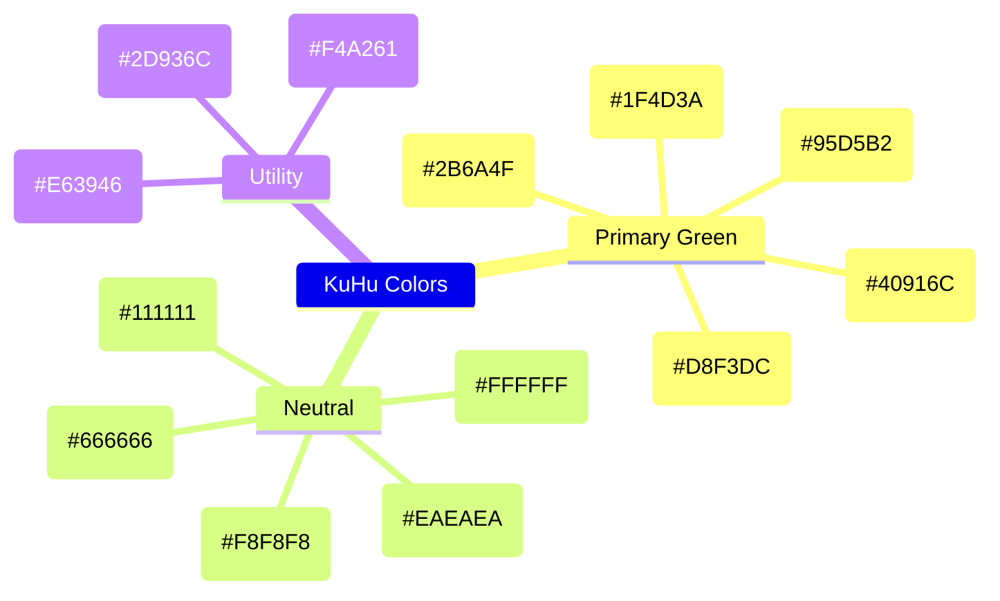

# UI Design Bible

> **Version:** 2.0  
> **Last Updated:** 19 July 2026  
> **Status:** Approved — Active design system

---

## Purpose

This document defines the complete design system for KuHu Apparels. It serves as the single source of truth for visual identity, design tokens, component specifications, layout guidelines, and interaction patterns. Every UI decision should trace back to this document.

---

## Table of Contents

1. [Brand Identity](#1-brand-identity)
2. [Color Palette](#2-color-palette)
3. [Typography](#3-typography)
4. [Spacing](#4-spacing)
5. [Border Radius](#5-border-radius)
6. [Elevation](#6-elevation)
7. [Design Tokens Summary](#7-design-tokens-summary)
8. [Buttons](#8-buttons)
9. [Inputs & Forms](#9-inputs--forms)
10. [Cards](#10-cards)
11. [Tables](#11-tables)
12. [Navigation](#12-navigation)
13. [Product Cards](#13-product-cards)
14. [Filters](#14-filters)
15. [Header](#15-header)
16. [Footer](#16-footer)
17. [Homepage Layout](#17-homepage-layout)
18. [Product Listing Page (PLP)](#18-product-listing-page-plp)
19. [Product Detail Page (PDP)](#19-product-detail-page-pdp)
20. [Cart Page](#20-cart-page)
21. [Checkout Page](#21-checkout-page)
22. [Customizer Page](#22-customizer-page)
23. [Responsive Rules](#23-responsive-rules)
24. [Animations](#24-animations)
25. [Accessibility](#25-accessibility)
26. [Image Guidelines](#26-image-guidelines)
27. [Icons](#27-icons)
28. [Tailwind CSS Mapping](#28-tailwind-css-mapping)

---

## 1. Brand Identity

### Brand Essence

KuHu Apparels is **premium, confident, modern, and personal**. The visual identity should communicate quality without being flashy, sophistication without being cold.

### Design Principles

| Principle | Description |
|---|---|---|
| **Clean & Minimal** | Ample whitespace, clear hierarchy, no visual clutter. No badges, no ratings, no huge stickers. |
| **Green as Accent** | Forest green used sparingly — primary buttons, hover/active states, selected filters. Rest of UI is monochrome. |
| **Content First** | Product images lead. Typography supports, never competes. Generous image sizes (60% on PDP). |
| **One Button Style** | Single primary button style everywhere: forest green bg, white text, 10px radius, 48px height. |

### Mood Board Descriptors

- Minimalist, monochrome with green accents
- Clean sans-serif throughout (no serif in UI)
- White backgrounds, thin borders
- Generous whitespace, high-quality product photography
- Premium but understated

---

## 2. Color Palette

### Primary Palette


```mermaid
mindmap
  KuHu Colors
    Primary Green
      Deep Forest (#1F4D3A)
      Hover Green (#2B6A4F)
      Light Green (#40916C)
      Pale Green (#95D5B2)
      Very Pale (#D8F3DC)
    Neutral
      White (#FFFFFF)
      Section BG (#F8F8F8)
      Border (#EAEAEA)
      Secondary Text (#666666)
      Primary Text (#111111)
    Utility
      Success (#2D936C)
      Error (#E63946)
      Warning (#F4A261)
```

#### Detailed Swatches

| Token | Hex | Usage |
|---|---|---|
| `--color-primary-900` | `#1F4D3A` | Primary buttons, selected states, active nav |
| `--color-primary-700` | `#2B6A4F` | Hover states on primary elements |
| `--color-primary-500` | `#40916C` | Secondary hover states |
| `--color-primary-300` | `#95D5B2` | Subtle borders, backgrounds |
| `--color-primary-100` | `#D8F3DC` | Very subtle backgrounds |

| Token | Hex | Usage |
|---|---|---|
| `--color-neutral-0` | `#FFFFFF` | Page background, card backgrounds |
| `--color-neutral-100` | `#F8F8F8` | Section backgrounds, alternate rows |
| `--color-neutral-200` | `#EAEAEA` | Borders, dividers, thin rules |
| `--color-neutral-400` | `#ADB5BD` | Disabled text, placeholders, muted icons |
| `--color-neutral-600` | `#666666` | Secondary text, captions, labels |
| `--color-neutral-900` | `#111111` | Primary text, headings |

| Token | Hex | Usage |
|---|---|---|
| `--color-success` | `#2D936C` | Success messages, in-stock |
| `--color-error` | `#E63946` | Error messages, out-of-stock |
| `--color-warning` | `#F4A261` | Warnings, low stock |

### Color Usage Rules

- **Green is an accent, not a theme.** Use it sparingly — buttons, hover/active states, selected filters. The majority of the UI is monochrome (white, grays, black).
- **White background** (`#FFFFFF`) is the default page background. Section backgrounds use `#F8F8F8`.
- **Primary text:** `#111111` (near black, not pure black).
- **Secondary text:** `#666666` (not too light, not too dark).
- **Borders:** `#EAEAEA` — thin, subtle. Used for navbar bottom border, card borders, dividers.
- **No accent/gold colors.** Removed in v2.0. Green is the only brand color in the UI.
- Ensure minimum contrast ratio of **4.5:1** for normal text, **3:1** for large text (WCAG AA).

---

## 3. Typography

### Font Family

| Usage | Font | Fallback |
|---|---|---|
| Logo / Brand | `Playfair Display` | `Georgia, serif` |
| UI (headings + body) | `Inter` | `-apple-system, BlinkMacSystemFont, sans-serif` |
| Mono (code) | `JetBrains Mono` | `monospace` |

> **Rule:** No decorative/serif fonts in the UI. Let the logo carry the personality. All headings, buttons, labels, body text use Inter (clean sans-serif).

### Font Loading Strategy

- Use `font-display: swap` to ensure text remains visible during font load.
- Load `Inter` with `font-display: swap` — text is readable with fallback.
- Playfair Display is used **only** for the logo. Load it but it is not critical for the UI.
- Subset fonts to Latin characters only to reduce file size.

### Type Scale

| Level | Size | Weight | Line Height | Letter Spacing | Font |
|---|---|---|---|---|---|
| **Display** | `4xl` — 3rem (48px) | Bold (700) | 1.1 | -0.02em | Inter |
| **H1** | `3xl` — 2.25rem (36px) | Bold (700) | 1.2 | -0.02em | Inter |
| **H2** | `2xl` — 1.5rem (24px) | Bold (700) | 1.3 | -0.01em | Inter |
| **H3** | `xl` — 1.25rem (20px) | Semibold (600) | 1.4 | 0 | Inter |
| **H4** | `lg` — 1.125rem (18px) | Semibold (600) | 1.4 | 0 | Inter |
| **Body Large** | `lg` — 1.125rem (18px) | Regular (400) | 1.6 | 0 | Inter |
| **Body** | `base` — 1rem (16px) | Regular (400) | 1.6 | 0 | Inter |
| **Body Small** | `sm` — 0.875rem (14px) | Regular (400) | 1.5 | 0 | Inter |
| **Caption** | `xs` — 0.75rem (12px) | Regular (400) | 1.4 | 0.01em | Inter |
| **Price** | `xl` — 1.25rem (20px) | Bold (700) | 1.3 | 0 | Inter |

### Responsive Type Scale

| Level | Mobile | Tablet | Desktop |
|---|---|---|---|
| Display | 2rem (32px) | 2.5rem (40px) | 3rem (48px) |
| H1 | 1.75rem (28px) | 2rem (32px) | 2.25rem (36px) |
| H2 | 1.25rem (20px) | 1.375rem (22px) | 1.5rem (24px) |
| Body | 0.938rem (15px) | 1rem (16px) | 1rem (16px) |

### Typography Rules

- Maximum line length for readability: **65-75 characters** per line.
- Heading to body spacing: `1.5rem` (24px).
- Paragraph spacing: `1rem` (16px).
- Do not justify text.
- Do not use italic for long passages — reserve for captions and quotes.
- Links in body text should be underlined.

---

## 4. Spacing

### Spacing Scale (Tailwind Compatible)

| Token | Size | Rem | PX | Usage |
|---|---|---|---|---|
| `space-0` | 0 | 0 | 0 | None |
| `space-1` | `px` | 0.0625 | 1 | Borders, dividers |
| `space-2` | `0.5` | 0.5 | 8 | Tight padding (badges, tags) |
| `space-3` | `3` | 0.75 | 12 | Tight spacing (icon + text) |
| `space-4` | `4` | 1 | 16 | Default padding (cards, buttons) |
| `space-5` | `5` | 1.25 | 20 | Section padding |
| `space-6` | `6` | 1.5 | 24 | Card padding, section spacing |
| `space-8` | `8` | 2 | 32 | Section spacing |
| `space-10` | `10` | 2.5 | 40 | Page section gaps |
| `space-12` | `12` | 3 | 48 | Major sections |
| `space-16` | `16` | 4 | 64 | Page padding |
| `space-20` | `20` | 5 | 80 | Hero section padding |
| `space-24` | `24` | 6 | 96 | Full section spacing |

### Spacing Rules

- Use multiples of `space-4` (16px) for consistent rhythm.
- Component padding: `space-6` (24px) for cards, `space-4` (16px) for mobile.
- Section spacing: minimum `space-12` (48px) between major sections.
- Grid gap: `space-4` (16px) mobile, `space-6` (24px) desktop.

---

## 5. Border Radius

| Token | Value | Usage |
|---|---|---|
| `radius-none` | 0 | Sharp edges (tables, headers) |
| `radius-sm` | 4px | Inputs, buttons small |
| `radius-md` | 8px | Cards, buttons, modals |
| `radius-lg` | 12px | Large cards, containers |
| `radius-xl` | 16px | Dialogs, sheets |
| `radius-full` | 9999px | Avatars, badges, pills |

---

## 6. Elevation

### Shadow Tokens

| Token | Value | Usage |
|---|---|---|
| `shadow-sm` | `0 1px 2px rgba(0,0,0,0.05)` | Subtle separation (cards) |
| `shadow-md` | `0 4px 6px rgba(0,0,0,0.07)` | Moderate (dropdowns, hover) |
| `shadow-lg` | `0 10px 15px rgba(0,0,0,0.1)` | High (modals, sheets) |
| `shadow-xl` | `0 20px 25px rgba(0,0,0,0.15)` | Maximum (toasts, dialogs) |

### Usage Rules

- Use `shadow-sm` as the default card elevation.
- Elevate on hover/interaction: card hover → `shadow-md`.
- Modals and dropdowns: `shadow-lg` or `shadow-xl`.
- Avoid elevation on text-heavy content (readability concern).

---

## 7. Design Tokens Summary

```css
:root {
  /* Colors */
  --color-primary-900: #1F4D3A;
  --color-primary-700: #2B6A4F;
  --color-primary-500: #40916C;
  --color-primary-300: #95D5B2;
  --color-primary-100: #D8F3DC;
  
  --color-neutral-0: #FFFFFF;
  --color-neutral-100: #F8F8F8;
  --color-neutral-200: #EAEAEA;
  --color-neutral-400: #ADB5BD;
  --color-neutral-600: #666666;
  --color-neutral-900: #111111;
  
  --color-success: #2D936C;
  --color-error: #E63946;
  --color-warning: #F4A261;

  /* Typography */
  --font-heading: 'Playfair Display', Georgia, serif;
  --font-body: Inter, -apple-system, BlinkMacSystemFont, sans-serif;

  /* Spacing */
  --space-1: 0.25rem;
  --space-2: 0.5rem;
  --space-3: 0.75rem;
  --space-4: 1rem;
  --space-6: 1.5rem;
  --space-8: 2rem;
  --space-12: 3rem;
  --space-16: 4rem;
  --space-20: 5rem;

  /* Radius */
  --radius-sm: 4px;
  --radius-md: 8px;
  --radius-lg: 10px;
  --radius-xl: 16px;
  --radius-full: 9999px;

  /* Shadows */
  --shadow-sm: 0 1px 2px rgba(0,0,0,0.05);
  --shadow-md: 0 4px 6px rgba(0,0,0,0.07);
  --shadow-lg: 0 10px 15px rgba(0,0,0,0.1);

  /* Transitions */
  --transition-fast: 150ms ease;
  --transition-base: 250ms ease;
  --transition-slow: 400ms ease;
}
```

---

## 8. Buttons

### Button Philosophy

**One primary button style everywhere.** No secondary, tertiary, or outlined variants in the MVP. Every CTA looks the same — forest green, white text, 10px radius, 48px height. This creates consistency and trains users to recognize actionable elements.

| Level | Use Case | Style |
|---|---|---|
| **Primary** | All CTAs (Add to Cart, Shop Now, Apply, Checkout, Save) | Filled `primary-900` (`#1F4D3A`), white text |
| **Text Link** | Subtle actions (Cancel, Remove, Clear All) | Text only, `neutral-600`, underlined on hover |

### Primary Button

| Property | Value |
|---|---|
| Background | `primary-900` (`#1F4D3A`) |
| Text | White |
| Hover bg | `primary-700` (`#2B6A4F`) |
| Disabled bg | `neutral-200` (`#EAEAEA`) |
| Disabled text | `neutral-400` (`#ADB5BD`) |
| Border radius | `10px` |
| Font | Inter, Semibold (600) |
| Height | `48px` (fixed) |
| Padding | `16px 32px` (horizontal) |
| Transition | all `200ms ease` |

| State | Background | Text | Border |
|---|---|---|---|
| Default | `primary-900` (`#1F4D3A`) | White | None |
| Hover | `primary-700` (`#2B6A4F`) | White | None |
| Active | `primary-900` | White | None |
| Disabled | `neutral-200` (`#EAEAEA`) | `neutral-400` (`#ADB5BD`) | None |
| Loading | `primary-900` | White + spinner | None |

### Button Sizes

| Size | Height | Padding | Font Size |
|---|---|---|---|
| Small (`sm`) | 36px | 12px 20px | 0.875rem (14px) |
| Default (`md`) | 48px | 16px 32px | 1rem (16px) |
| Full width | 48px | 16px 32px | 1rem (16px) |

### Button States Checklist

- [x] Default (forest green)
- [x] Hover (lighter green)
- [x] Active/Pressed (darker green)
- [x] Focus (2px outline, `primary-300`)
- [x] Disabled (gray, no pointer events)
- [x] Loading (spinner, disabled)
- [x] Full width variant

---

## 9. Inputs & Forms

### Text Input

| State | Border | Background | Text |
|---|---|---|---|
| Default | `neutral-300` 1px | White | `neutral-900` |
| Hover | `primary-300` 1px | White | `neutral-900` |
| Focus | `primary-500` 2px | White | `neutral-900` |
| Error | `error` 1px | `error` + 5% opacity | `neutral-900` |
| Disabled | `neutral-200` | `neutral-100` | `neutral-400` |
| Read-only | `neutral-200` dashed | `neutral-100` | `neutral-600` |

### Input Sizes

| Size | Padding | Font Size | Height |
|---|---|---|---|
| Small | 8px 12px | 0.875rem | 36px |
| Default | 12px 16px | 1rem | 44px |
| Large | 16px 20px | 1.125rem | 52px |

### Form Elements Checklist

- [x] Text input
- [x] Email input (with type validation)
- [x] Password input (with show/hide toggle)
- [x] Search input (with icon, clear button)
- [x] Textarea (with resize handle)
- [x] Select dropdown (custom styled)
- [x] Checkbox (custom styled)
- [x] Radio button (custom styled)
- [x] Toggle/Switch
- [x] File upload (drag-and-drop zone)
- [x] Color picker (swatch-based for product options)

### Form Layout Rules

- Labels above inputs (not inline) for readability.
- Helper text below input (`sm`, `neutral-600`).
- Error message below input (`sm`, `error`, with icon).
- Required fields marked with `*` in `error` color.
- Group related fields with fieldset and legend.
- Submit button aligned to the left on mobile, right on desktop.

---

## 10. Cards

### Card Specification

| Property | Value |
|---|---|
| Background | White |
| Border | 1px `neutral-200` |
| Radius | `md` (8px) |
| Padding | `space-6` (24px) |
| Shadow | `shadow-sm` |
| Hover | `shadow-md` transition |
| Content spacing | `space-4` (16px) |

### Card Variants

| Variant | Use | Changes |
|---|---|---|
| **Default** | Generic content container | As above |
| **Clickable** | Product card, link card | Hover: `shadow-md`, cursor pointer |
| **Elevated** | Featured content | `shadow-md` default, `shadow-lg` hover |
| **Bordered** | Section of a form | No shadow, border only |
| **Flat** | Nested content | No shadow, no border, `neutral-100` bg |

---

## 11. Tables

⚠️ **TODO:** Tables are not in MVP scope. This section will be expanded when order management and admin tables are designed.

### Basic Rules

- Header row: `neutral-100` background, `semibold` weight.
- Alternating row colors for readability.
- Responsive: horizontal scroll on mobile OR convert to cards.
- Sortable column headers indicated with arrows.
- Action column right-aligned.

---

## 12. Navigation

### Primary Navigation

- **Sticky header** on scroll (mobile and desktop).
- **Height:** 80px (desktop), 64px (mobile).
- **Border bottom:** 1px solid `#EAEAEA` (thin, subtle).
- **Background:** White (`#FFFFFF`).
- **Z-index:** 50.
- **Green only on hover/active** — default nav links are `neutral-900` or `neutral-600`.

### Desktop Layout (80px)

```
┌────────────────────────────────────────────────────────────┐
│  MEN    WOMEN    THEMES        KuHu        🔍    🛒    👤  │
│                                                             │
└────────────────────────────────────────────────────────────┘
│← left aligned →│     ← center →     │← right aligned →│
```

- **Left:** Men, Women, Themes (text links, `neutral-600`, `sm` uppercase, hover → green)
- **Center:** Logo (Playfair Display serif, carries the brand personality)
- **Right:** Search icon, Cart icon (with badge), Profile icon

### Mobile Layout (64px)

- Logo centered.
- Hamburger (☰) left — opens slide-out drawer with nav links.
- Cart icon + Profile icon right.
- Search icon hidden behind hamburger or shown as a top bar toggle.

### Navigation Items

1. **Men** — Text link, scrolls to section or navigates to `/products?section=men`
2. **Women** — Text link, navigates to `/products?section=women`
3. **Themes** — Dropdown on hover (desktop), expandable accordion in mobile drawer
4. **Logo** — Link to home (`/`)
5. **Search** — Icon → expands to full input overlay or navigates to search page
6. **Cart** — Icon + badge count (primary green badge, white text)
7. **Profile** — Icon → dropdown: Login/Register or Profile/Logout

### Nav Link Styles

| State | Style |
|---|---|
| Default | `neutral-600`, `text-sm`, `uppercase`, `tracking-wide` |
| Hover | `primary-900` (`#1F4D3A`) |
| Active / Current | `primary-900`, semibold |
| Mobile drawer | `neutral-900`, `text-base`, full-width tap targets |

### Breadcrumbs

- Separator: `/`
- Current page: `neutral-900`, `semibold`
- Parent pages: `neutral-600`, clickable
- Home is always first

---

## 13. Product Cards

### Product Card Layout (Grid)

```
┌──────────────────┐
│                  │
│     IMAGE        │
│     (4:5)        │
│                  │
├──────────────────┤
│  Product Name    │
│  ₹999            │
└──────────────────┘
```

**Very clean.** No category tags, no badges, no ratings, no color swatches, no Add to Cart button. Only image + name + price. The product image does the selling.

### Product Card Specs

| Element | Style |
|---|---|
| Container | White bg, no border, `rounded-lg` (10px) |
| Image | 4:5 aspect ratio, `object-cover`, `loading="lazy"` |
| Hover | Subtle `shadow-md` transition, image zoom (scale 1.02), cursor pointer |
| Name | `text-sm`, `font-medium`, `text-neutral-900`, line-clamp 2 |
| Price | `text-base`, `font-bold`, `text-neutral-900` |
| Spacing | `p-3` (image to text gap), no extra padding around the card |

### Grid Behavior

| Breakpoint | Columns | Gap |
|---|---|---|
| Mobile (< 640px) | 2 | 12px |
| Tablet (640-1024px) | 3 | 16px |
| Desktop (> 1024px) | 4 | 24px |

---

## 14. Filters

### Filter Types

| Filter | Type | Behavior |
|---|---|---|
| Themes | Checkbox list | Multiple select |
| Price Range | Min/max inputs | Debounced (300ms) |
| Availability | Toggle (In Stock Only) | Single toggle |
| Sort By | Select dropdown | Re-fetches sorted results |

### Filter Layout

- **Desktop:** Left sidebar, sticky on scroll, `w-64`.
- **Mobile:** Triggered by [Filters] and [Sort] buttons below the page title.
  - [Filters] opens a bottom sheet or overlay with theme/price/availability.
  - [Sort] opens a simple select or action sheet with sort options.
- Active filter count displayed on the [Filters] button (e.g., "Filters (2)").
- "Clear All" link at top of filter section.

### Active Filters Pills

```
[  Anime  ✕ ]  [  ₹500-₹1500  ✕ ]  [ Clear All ]
```

- Pill: `neutral-100` bg (`#F8F8F8`), `sm`, `neutral-900` text, `✕` icon.
- Click `✕` to remove individual filter.
- "Clear All" is a text link, `sm`, `neutral-600`.

---

## 15. Header

### Layout

```
┌────────────────────────────────────────────────────────────┐
│  MEN    WOMEN    THEMES        KuHu        🔍    🛒    👤  │
└────────────────────────────────────────────────────────────┘
```

### Header Specs

| Property | Value |
|---|---|
| Height (mobile) | 64px |
| Height (desktop) | 80px |
| Background | White (`#FFFFFF`) |
| Border bottom | 1px `#EAEAEA` |
| Z-index | 50 |
| Position | Fixed top, no backdrop blur (opaque white) |

### Desktop Header Behavior

- **Left:** Men, Women, Themes — text links in `text-sm uppercase tracking-wide text-neutral-600`.
- **Center:** Logo in `font-heading` (Playfair Display), larger size, `text-neutral-900`.
- **Right:** Search icon, Cart icon (with badge), Profile icon — all 24px, `text-neutral-600`, hover → green.
- Nav links turn `primary-900` (`#1F4D3A`) on hover/active. Not green by default.
- No dropdown menus in MVP. Themes click navigates to `/products` with theme filter.

### Mobile Header Behavior

- Logo centered.
- Hamburger (☰) left — opens full-height slide-out drawer.
- Cart icon right (with badge).
- Profile icon right (or combined under hamburger).
- Cart badge: `primary-900` bg (`#1F4D3A`), white text, `xs`, centered on icon.

---

## 16. Footer

### Layout

```
┌──────────────────────────────────────────────────┐
│                                                   │
│  KuHu Apparels                                    │
│  Premium fashion, crafted for you.                │
│                                                   │
│  ┌────────────────┐ ┌────────────────┐           │
│  │  Customer Care  │ │  Connect       │           │
│  │  Contact Us     │ │  Instagram     │           │
│  │  Shipping       │ │  Facebook      │           │
│  │  Returns        │ │  Twitter / X   │           │
│  │  FAQ            │ │                │           │
│  └────────────────┘ └────────────────┘           │
│                                                   │
│  ─────────────────────────────────────────────────│
│                                                   │
│  © 2026 KuHu Apparels. All rights reserved.       │
└──────────────────────────────────────────────────┘
```

### Footer Specs

| Property | Value |
|---|---|
| Background | `#F8F8F8` (section background, not green) |
| Top border | 1px `#EAEAEA` |
| Text | `neutral-600` (`#666666`) for links, `neutral-900` for heading |
| Padding | `py-12` top/bottom |
| Layout | 2 columns (desktop), stacked (mobile) |
| Font | Inter, `text-sm` for links, `text-sm font-semibold` for headings |

---

## 17. Homepage Layout

### Section Order (Top to Bottom)

1. **Navbar** (sticky, 80px)
2. **Hero Banner** — Full-width, single static banner (no carousel). Bold heading + CTA.
3. **Popular Themes** — Image cards (4 across desktop, horizontal scroll mobile). Each card = theme image + theme name overlay.
4. **Featured Products** (optional) — 8-product grid, same ProductCard style. Only if products exist in a "featured" set.
5. **All Products** — Infinite scroll product grid with filter/sort controls.
6. **Footer**

### Hero Banner

| Property | Value |
|---|---|
| Type | Single static banner (not a carousel/slider) |
| Height (mobile) | 50vh |
| Height (desktop) | 60vh |
| Image | Full-bleed, `object-cover`, dark overlay (gradient for text readability) |
| Text overlay | Left-aligned or centered, white text |
| Heading | Display-sized, bold sans-serif |
| Subtext | Body-sized, lighter weight |
| CTA | Primary button (forest green, white text) |
| No autoplay, no dots, no arrows | Keep it static |

### Popular Themes Section

```
┌─────────────┐ ┌─────────────┐ ┌─────────────┐ ┌─────────────┐
│             │ │             │ │             │ │             │
│  Anime Tee  │ │  Quote Tee  │ │  God Tee    │ │  Music Tee  │
│             │ │             │ │             │ │             │
├─────────────┤ ├─────────────┤ ├─────────────┤ ├─────────────┤
│ Anime       │ │ Quotes      │ │ Gods        │ │ Music       │
└─────────────┘ └─────────────┘ └─────────────┘ └─────────────┘
```

| Property | Value |
|---|---|
| Layout | 4 cards across (desktop), horizontal snap-scroll (mobile) |
| Card | Image background + theme name overlay at bottom |
| Image | 4:5 aspect ratio, `object-cover`, `rounded-lg` |
| Name overlay | Semi-transparent dark gradient at bottom, white text |
| Link | Click navigates to `/products?theme={slug}` |

---

## 18. Product Listing Page (PLP)

### Layout

```
┌──────────────────────────────────────────────────┐
│  Home / Men / T-Shirts              Showing 12   │
│                                                   │
│  ┌──────┐  ┌──────┐ ┌──────┐ ┌──────┐           │
│  │Filter│  │Sort: │ │      │ │      │           │
│  │Panel │  │Newest│ │      │ │      │           │
│  │      │  └──────┘ └──────┘ └──────┘           │
│  │[✓] Men│                                        │
│  │[ ]Women│  ┌──────┐ ┌──────┐ ┌──────┐ ┌──────┐│
│  │       │  │      │ │      │ │      │ │      ││
│  │Sizes  │  │ Card │ │ Card │ │ Card │ │ Card ││
│  │[S][M] │  │      │ │      │ │      │ │      ││
│  │[L][XL]│  └──────┘ └──────┘ └──────┘ └──────┘│
│  │       │                                        │
│  │Price  │  ┌──────┐ ┌──────┐ ┌──────┐ ┌──────┐│
│  │[Min]  │  │      │ │      │ │      │ │      ││
│  │[Max]  │  │ Card │ │ Card │ │ Card │ │ Card ││
│  └──────┘  │      │ │      │ │      │ │      ││
│            └──────┘ └──────┘ └──────┘ └──────┘│
│                                                   │
│              [  1  2  3  ...  5  ]                │
└──────────────────────────────────────────────────┘
```

### PLP Specs

- **Breadcrumb** at top.
- **Result count** next to breadcrumb.
- **Active filters** as removable pills below breadcrumb.
- **Sort dropdown** top-right of product grid.
- **Product grid** (2 cols mobile, 3 cols tablet, 4 cols desktop).
- **Pagination** at bottom (numbered with prev/next).
- **Empty state:** "No products match your filters" with "Clear Filters" button.

---

## 19. Product Detail Page (PDP)

### Layout

```
┌────────────────────────────────────────────────────┐
│  Home / Men / T-Shirts / Product Name               │
│                                                     │
│  ┌──────────────────────────┐  ┌────────────────┐  │
│  │                          │  │  Category       │  │
│  │                          │  │                 │  │
│  │       IMAGE (60%)        │  │  Product Name   │  │
│  │                          │  │                 │  │
│  │     Large, clean,        │  │  ₹999           │  │
│  │     no thumbnails        │  │                 │  │
│  │     no zoom controls     │  │  Description    │  │
│  │                          │  │                 │  │
│  │                          │  │  Color:         │  │
│  │                          │  │  ⚫ ⚪           │  │
│  │                          │  │                 │  │
│  │                          │  │  Size:          │  │
│  │                          │  │  [S] [M] [L]   │  │
│  │                          │  │                 │  │
│  │                          │  │  [Add to Cart]  │  │
│  └──────────────────────────┘  └────────────────┘  │
│                                                     │
│  ┌────────────────────────────────────────────┐    │
│  │  Description (full width below)            │    │
│  │  Product details, material, fit...         │    │
│  └────────────────────────────────────────────┘    │
└────────────────────────────────────────────────────┘
```

### PDP Sections

| Section | Details |
|---|---|
| **Image** | 60% width, 4:5 aspect ratio, `object-cover`. Single image (no gallery/thumbnails in MVP). Click to expand/zoom if needed. |
| **Product Info** | Category label (`text-sm uppercase tracking-wide text-neutral-600`), name (`text-2xl font-bold`), price (`text-3xl font-bold text-neutral-900`), short description. |
| **Color Selector** | Circular swatches, 32px, `border-neutral-300` default, `border-neutral-900 ring-2 ring-neutral-900 ring-offset-2` selected. |
| **Size Selector** | Pill buttons, 40px height, `border-neutral-300` default, `border-neutral-900 bg-neutral-900 text-white` selected. Out of stock: line-through, `text-neutral-300`, `cursor-not-allowed`. |
| **Add to Cart** | Full-width primary button (48px, 10px radius, forest green). |
| **Description** | Full width below the fold. Clean typography, generous line height. |

### Size Selector

- Pill buttons: `[S] [M] [L] [XL]`
- Available sizes: `neutral-300` border, white bg, clickable.
- Unavailable sizes: `neutral-200` bg, `neutral-300` text, line-through, not clickable.
- Selected size: `neutral-900` bg, white text.
- No size guide in MVP.

---

## 20. Cart Page

### Layout

```
┌──────────────────────────────────────────────────┐
│  Shopping Cart (3 items)                         │
│                                                   │
│  ┌────────────────────────────────────────┐      │
│  │  [Image]  Product Name        ₹1,499   │      │
│  │           Size: M  Color: Black        │      │
│  │           Qty: [-] 2 [+]     ₹2,998   │      │
│  │           [Remove]  [Move to Wishlist]│      │
│  ├────────────────────────────────────────┤      │
│  │  [Image]  Product Name          ₹999   │      │
│  │           Size: L  Color: Navy         │      │
│  │           Qty: [-] 1 [+]       ₹999   │      │
│  │           [Remove]  [Move to Wishlist]│      │
│  └────────────────────────────────────────┘      │
│                                                   │
│  ┌──────────────────────┐                         │
│  │  Order Summary        │                         │
│  │  Subtotal:   ₹3,997  │                         │
│  │  Shipping:   ₹49     │                         │
│  │  ──────────────────  │                         │
│  │  Total:      ₹4,046  │                         │
│  │                       │                         │
│  │  [Proceed to Checkout]│                         │
│  │                       │                         │
│  │  [Continue Shopping]  │                         │
│  └──────────────────────┘                         │
│                                                   │
│  [Coupon Code] [Apply]                            │
└──────────────────────────────────────────────────┘
```

### Cart States

| State | Display |
|---|---|
| **Has items** | Cart item list + order summary |
| **Empty** | Illustration + "Your cart is empty" + "Start Shopping" CTA |
| **Loading** | Skeleton rows (3) |
| **Error** | Error message + retry button |

### Quantity Controls

- `[-]` / `[+]` buttons with current quantity displayed center.
- Minimum: 1. Maximum: stock quantity.
- Deleting last item → "Item removed" toast with undo option.

---

## 21. Checkout Page

### Layout

```
┌────────────────────────────────────────────────────┐
│  Checkout                                          │
│                                                     │
│  ┌────────────────────────┐  ┌──────────────────┐  │
│  │  Contact Information   │  │  Order Summary    │  │
│  │  Email *               │  │                   │  │
│  │  [________________]    │  │  [Image] Item x2  │  │
│  │                        │  │  [Image] Item x1  │  │
│  │  Shipping Address      │  │                   │  │
│  │  Full Name *           │  │  Subtotal  ₹3,997 │  │
│  │  [________________]    │  │  Shipping   ₹49   │  │
│  │                        │  │  ───────────────  │  │
│  │  Phone *               │  │  Total     ₹4,046 │  │
│  │  [________________]    │  │                   │  │
│  │                        │  │                   │  │
│  │  Address *             │  │                   │  │
│  │  [________________]    │  │                   │  │
│  │                        │  │                   │  │
│  │  City *     Pincode *  │  │                   │  │
│  │  [______]   [______]   │  │                   │  │
│  │                        │  │                   │  │
│  │  State *               │  │                   │  │
│  │  [Select___________▼]  │  │                   │  │
│  │                        │  │                   │  │
│  │  ────────────────────  │  │                   │  │
│  │                        │  │                   │  │
│  │  Payment Method        │  │                   │  │
│  │  ○ Credit Card         │  │                   │  │
│  │  ○ UPI                 │  │                   │  │
│  │  ○ Net Banking         │  │                   │  │
│  │  ○ Wallet              │  │                   │  │
│  │                        │  │                   │  │
│  │  [Pay ₹4,046]         │  │                   │  │
│  └────────────────────────┘  └──────────────────┘  │
└────────────────────────────────────────────────────┘
```

### Checkout States

| State | Display |
|---|---|
| **Default** | Form with validation |
| **Submitting** | Loading spinner on button, fields disabled |
| **Error** | Field-level errors + toast for API errors |
| **Success** | Redirect to order confirmation |
| **Empty cart** | Redirect to cart page |

### Address Auto-Complete

TODO: Integrate pincode → city/state auto-fill API (PostPIN or similar).

---

## 22. Customizer Page

### Layout

```
┌──────────────────────────────────────────────────────┐
│  Customize Your Product                              │
│                                                       │
│  ┌────────────────────────┐  ┌────────────────────┐  │
│  │                        │  │  Tools              │  │
│  │      Canvas            │  │                     │  │
│  │                        │  │  ┌────────────────┐ │  │
│  │   [Product Preview]    │  │  │ Upload Logo    │ │  │
│  │                        │  │  └────────────────┘ │  │
│  │                        │  │                     │  │
│  │                        │  │  Shirt Color        │  │
│  │                        │  │  ⚪ ⚫ 🔵 🔴 🟢   │  │
│  │                        │  │                     │  │
│  │                        │  │  Logo Color         │  │
│  │                        │  │  ⚪ ⚫ 🔵 🔴 🟡   │  │
│  │                        │  │                     │  │
│  │                        │  │  Size & Position    │  │
│  │                        │  │  [+ Move +]         │  │
│  │                        │  │  [+ Resize +]       │  │
│  │                        │  │  [↻ Rotate]         │  │
│  │                        │  │                     │  │
│  │                        │  │  [Reset]  [Undo]    │  │
│  │                        │  │                     │  │
│  │                        │  │  [💾 Save Design]   │  │
│  │                        │  └────────────────────┘  │
│  └────────────────────────┘                           │
│                                                       │
│  [ ← Back to Product ]       [🛒 Add to Cart]        │
└──────────────────────────────────────────────────────┘
```

### Customizer Features

| Feature | Implementation |
|---|---|
| **Canvas** | Fabric.js with product template as background |
| **Logo Upload** | File input → image appears on canvas. Supported: PNG, SVG, JPG. Max 5MB. |
| **Shirt Color** | Preset color swatches change the product template color (CSS filter or layer swap) |
| **Logo Color** | Fabric.js filter to change logo color (preserves transparency) |
| **Move** | Fabric.js object dragging within bounds |
| **Resize** | Fabric.js corner handles, maintain aspect ratio |
| **Rotate** | Fabric.js rotation handle, snap to 15° increments |
| **Save Design** | Serialize canvas to JSON → POST to backend |
| **Preview** | Generate preview image via Cloudinary or canvas `toDataURL` |
| **Reset** | Clear all customizations, reload initial state |
| **Undo** | Fabric.js state history (last 10 actions) |

### Mobile Customizer

- Canvas takes full viewport height.
- Tools panel is a bottom sheet (draggable).
- Pinch to zoom canvas.
- Touch events for move/resize/rotate.

---

## 23. Responsive Rules

### Breakpoints

| Breakpoint | Width | Device |
|---|---|---|
| `xs` | < 375px | Small phones |
| `sm` | 375-639px | Phones |
| `md` | 640-1023px | Tablets |
| `lg` | 1024-1279px | Small desktop |
| `xl` | 1280-1535px | Desktop |
| `2xl` | ≥ 1536px | Large desktop |

### Layout Adaptation

| Page | Mobile | Tablet | Desktop |
|---|---|---|---|
| Homepage | Stack sections vertically, 2-col grid | Same as mobile, larger type | Hero full-width, multi-col |
| PLP | Filter as drawer, 2 cols | Filter as drawer, 3 cols | Filter sidebar, 4 cols |
| PDP | Stack: image → info → desc | Side-by-side image + info | Side-by-side, wider gallery |
| Cart | Stack: items → summary | Same | Side-by-side |
| Checkout | Stack: form → summary | Same | Side-by-side |
| Customizer | Full canvas + bottom sheet | Canvas + side panel | Canvas + side panel |

### Responsive Checklist

- [x] All pages tested at 375px, 768px, 1024px, 1440px
- [x] Touch targets minimum 44x44px on mobile
- [x] No horizontal scroll on any viewport
- [x] Text is readable without zooming
- [x] Forms are usable with one hand on mobile
- [x] Images are appropriately sized per viewport
- [x] Navigation is accessible via thumb zone on mobile

---

## 24. Animations

### Principles

- **Subtle:** Animations should enhance usability, not distract.
- **Fast:** Keep under 300ms for UI feedback, under 500ms for page transitions.
- **Purposeful:** Every animation should communicate something (state change, navigation, feedback).

### Animation Tokens

```css
:root {
  --ease-out: cubic-bezier(0.16, 1, 0.3, 1);
  --ease-in-out: cubic-bezier(0.65, 0, 0.35, 1);
  --duration-fast: 150ms;
  --duration-base: 250ms;
  --duration-slow: 400ms;
}
```

### Animation Map

| Element | Trigger | Animation | Duration |
|---|---|---|---|
| Button hover | Hover | Background color, subtle scale | 150ms |
| Button click | Click | Scale 0.97 → 1 | 100ms |
| Card hover | Hover | Elevation increase | 250ms |
| Modal/Sidebar | Open | Slide in + fade | 300ms |
| Modal/Sidebar | Close | Slide out + fade | 200ms |
| Toast | Show | Slide down + fade | 300ms |
| Toast | Dismiss | Slide up + fade | 200ms |
| Page transition | Route change | Fade (opacity 0 → 1) | 200ms |
| Product card appear | Scroll | Fade up + scale | 400ms, staggered |
| Add to cart | Click | Badge count increment + bounce | 300ms |
| Skeleton pulse | Loading | Opacity pulse | 1500ms infinite |

### Reduced Motion

- Respect `prefers-reduced-motion: reduce`.
- Disable all non-essential animations.
- Keep: opacity transitions (fade), color changes.
- Remove: scale, translate, rotate, bounce, pulse.

---

## 25. Accessibility

### Standards

- Target: **WCAG 2.1 AA** compliance.
- Screen reader support: **NVDA** (Windows) and **VoiceOver** (macOS/iOS).

### Requirements

#### Color & Contrast

| Element | Contrast Ratio | Standard |
|---|---|---|
| Normal text (< 18px) | ≥ 4.5:1 | AA |
| Large text (≥ 18px bold, ≥ 24px regular) | ≥ 3:1 | AA |
| UI components (borders, icons) | ≥ 3:1 | AA |

#### Keyboard Navigation

- All interactive elements focusable via `Tab`.
- Focus indicator: 2px solid `primary-500` outline, offset 2px.
- Skip to content link (first focusable element).
- Custom tab order where logical (not just DOM order).

#### Screen Reader

- All images have meaningful `alt` text (decorative images: `alt=""`).
- Form inputs have associated `<label>` elements.
- Error messages associated via `aria-describedby`.
- Dynamic content changes announced via `aria-live` regions.
- Custom controls (select, slider) have proper ARIA roles.

#### Semantic HTML

- Use semantic elements: `<nav>`, `<main>`, `<section>`, `<article>`, `<aside>`, `<footer>`.
- Heading hierarchy (h1 → h2 → h3) without skipping levels.
- Use `<button>` for buttons, `<a>` for links.
- Lists marked with `<ul>` / `<ol>`.

### Accessibility Checklist

- [ ] All images have alt text
- [ ] All form inputs have labels
- [ ] Color contrast meets AA minimum
- [ ] Focus indicator visible on all interactive elements
- [ ] Keyboard navigation works through all pages
- [ ] Screen reader can navigate page structure
- [ ] Error messages are announced
- [ ] `prefers-reduced-motion` respected
- [ ] Touch targets ≥ 44x44px on mobile
- [ ] Forms have proper autocomplete attributes

---

## 26. Image Guidelines

### Product Images

| Property | Requirement |
|---|---|
| Format | JPEG (photos), PNG (transparent), WebP (preferred) |
| Resolution | 2000px on longest side minimum |
| Aspect Ratio | 4:5 (portrait) |
| Background | White or transparent |
| File Size | < 500KB after compression |
| Zoom | High-res version at 4000px for zoom feature |

### Image Naming Convention

```
{product-sku}-{variant}-{view}-{index}.webp
```

Example: `tsh-001-blk-front-01.webp`

### Required Views per Product

| View | Required |
|---|---|
| Front | ✅ Yes |
| Back | ✅ Yes |
| Detail (fabric close-up) | Optional |
| Model wearing (lifestyle) | ⭐ Recommended |
| Customized example | ⭐ For customizer promotion |

### Image Optimization

- Upload original to Cloudinary.
- Use Cloudinary transformations for responsive images.
- Serve WebP with JPEG fallback.
- Implement lazy loading (`loading="lazy"`).
- Use `srcset` for responsive image sizes.

### Cloudinary Transformations

| Use Case | Transformation |
|---|---|
| Product card (grid) | `w_400,h_500,c_fill` |
| PDP main image | `w_800,h_1000,c_fill` |
| PDP zoom | `w_1200,h_1500,c_fill` |
| Thumbnail | `w_100,h_125,c_fill` |
| Cart item | `w_80,h_100,c_fill` |
| Hero banner | `w_1920,h_800,c_fill` |

---

## 27. Icons

### Icon Strategy

- Use **Lucide React** icons (open-source, consistent, comprehensive).
- Fallback: SVG inline for custom icons (logo, brand marks).
- Icon size follows type scale: `16px` (sm), `20px` (md), `24px` (lg), `32px` (xl).

### Required Icons

| Icon | Usage |
|---|---|
| `ShoppingCart` | Cart link, cart icon |
| `User` | Account link |
| `Search` | Search toggle |
| `Menu` | Mobile hamburger |
| `X` | Close, remove, dismiss |
| `Heart` | Wishlist/favorite |
| `Star` | Ratings |
| `ChevronDown` | Dropdowns, accordion |
| `ChevronLeft` | Back, previous |
| `ChevronRight` | Forward, next |
| `Plus`, `Minus` | Quantity controls |
| `Trash2` | Remove item |
| `Check` | Success, confirmation |
| `AlertCircle` | Error |
| `Info` | Information |
| `Loader2` | Loading spinner |
| `Package` | Orders |
| `Truck` | Shipping |
| `Shield` | Secure checkout |
| `CreditCard` | Payment |
| `Upload` | Logo upload |
| `RotateCw` | Rotate |
| `Move` | Move |
| `Maximize2` | Resize |
| `Undo2` | Undo |
| `RefreshCw` | Reset |
| `Instagram`, `Facebook`, `Twitter` | Social links |

### Icon Sizes Per Context

| Context | Size |
|---|---|
| Navigation (header) | 24px |
| Buttons (icon only) | 20px |
| Buttons (with text) | 16px |
| Input icons (prefix/suffix) | 16px |
| Toast/Dialog icons | 24px |
| Product card (favorite) | 20px |
| Footer social | 24px |

---

## 28. Tailwind CSS Mapping

### Custom Tailwind Theme (`index.css`)

```css
@import "tailwindcss";

@theme {
  /* ── Colors ── */
  --color-primary-900: #1F4D3A;
  --color-primary-700: #2B6A4F;
  --color-primary-500: #40916C;
  --color-primary-300: #95D5B2;
  --color-primary-100: #D8F3DC;

  --color-neutral-0: #FFFFFF;
  --color-neutral-100: #F8F8F8;
  --color-neutral-200: #EAEAEA;
  --color-neutral-400: #ADB5BD;
  --color-neutral-600: #666666;
  --color-neutral-900: #111111;

  --color-success: #2D936C;
  --color-error: #E63946;
  --color-warning: #F4A261;

  /* ── Typography ── */
  --font-heading: "Playfair Display", Georgia, serif;
  --font-body: Inter, -apple-system, BlinkMacSystemFont, sans-serif;

  /* ── Border Radius ── */
  --radius-sm: 4px;
  --radius-md: 8px;
  --radius-lg: 10px;
  --radius-xl: 16px;
  --radius-full: 9999px;

  /* ── Shadows ── */
  --shadow-sm: 0 1px 2px rgba(0,0,0,0.05);
  --shadow-md: 0 4px 6px rgba(0,0,0,0.07);
  --shadow-lg: 0 10px 15px rgba(0,0,0,0.1);
}
```

### Common Class Patterns

| Component | Tailwind Classes |
|---|---|
| Product card | `bg-neutral-0 rounded-lg hover:shadow-md transition-shadow duration-200` |
| Primary button | `bg-primary-900 text-white h-12 px-8 rounded-lg font-semibold hover:bg-primary-700 transition-colors duration-200 disabled:bg-neutral-200 disabled:text-neutral-400` |
| Text input | `w-full h-12 px-4 border border-neutral-200 rounded-lg focus:border-primary-900 focus:ring-2 focus:ring-primary-300 outline-none` |
| Section container | `max-w-7xl mx-auto px-4 sm:px-6 lg:px-8 py-12 lg:py-16` |
| Page heading | `text-2xl font-bold text-neutral-900` |
| Breadcrumb | `text-sm text-neutral-600 [&>span]:text-neutral-900 [&>span]:font-semibold` |
| Nav link | `text-sm uppercase tracking-wide text-neutral-600 hover:text-primary-900 transition-colors duration-200` |

---

## Appendix: Design Review Checklist

Use before implementing any new page or component:

- [ ] Design tokens used (colors, spacing, typography, radius)
- [ ] Mobile-first responsive breakpoints applied
- [ ] Accessibility requirements met
- [ ] Loading/empty/error states accounted for
- [ ] Animations follow the defined patterns
- [ ] Images follow guidelines (format, size, alt text)
- [ ] Tailwind configuration values used (not hardcoded values)
- [ ] Icons consistent (Lucide, correct size)

---

## References

- [Project Vision](./01_Project_Vision.md) — Brand identity & product scope
- [Architecture Decisions](./03_Architecture_Decisions.md) — Technical decisions for UI
- [API Conventions](./05_API_Conventions.md) — Endpoint patterns
- [Tailwind CSS Documentation](https://tailwindcss.com/docs)
- [Lucide Icons](https://lucide.dev)
- [WCAG 2.1 AA Guidelines](https://www.w3.org/TR/WCAG21/)

---

*This UI Design Bible is a living document. Update as the design evolves.*
