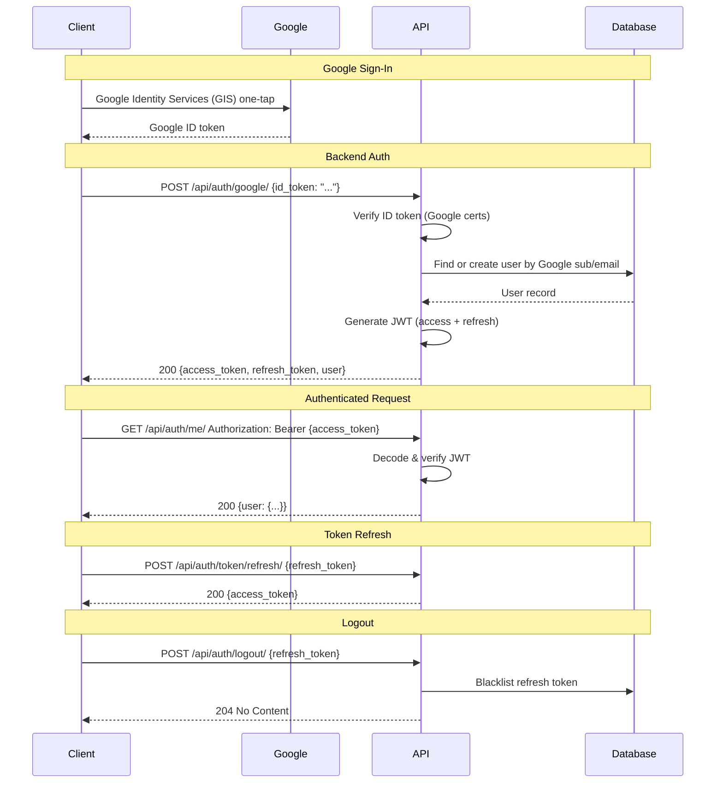
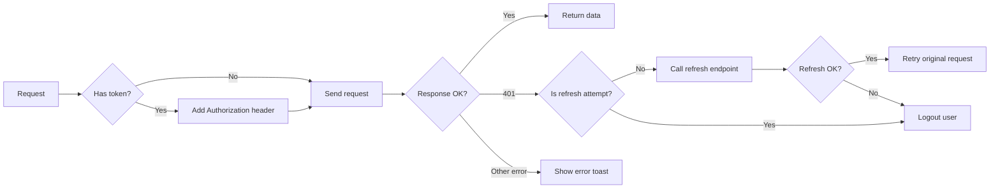

# API Conventions

> **Version:** 1.0  
> **Last Updated:** 5 July 2026  
> **Status:** Draft

---

## Purpose

This document defines the API design standards for KuHu Apparels. All endpoints should follow these conventions for consistency, predictability, and maintainability.

---

## 1. Base URL

| Environment | URL |
|---|---|
| Development | `http://localhost:8000/api/` |
| Production | `https://{railway-domain}.railway.app/api/` |
| Custom Domain (Future) | `https://api.kuhuapparels.com/api/` |

---

## 2. API Design Principles

1. **RESTful** — Resources, not actions. Use HTTP methods for CRUD.
2. **Consistent** — Same patterns across all endpoints.
3. **Versioned** — URL-based versioning (`/api/v1/`) when we need breaking changes.
4. **Self-descriptive** — Responses include enough context to understand the data.
5. **Secure** — Authentication required for protected resources, HTTPS only in production.
6. **Performant** — Pagination for lists, sparse fieldsets, eager loading.

---

## 3. URL Structure

```
/api/{resource}/
/api/{resource}/{id}/
/api/{resource}/{id}/{sub-resource}/
/api/{resource}/{id}/{sub-resource}/{sub-id}/
```

### Example URLs

| Method | URL | Description |
|---|---|---|
| GET | `/api/products/` | List products |
| GET | `/api/products/{id}/` | Product detail |
| POST | `/api/orders/` | Create order |
| GET | `/api/orders/{id}/` | Order detail |
| POST | `/api/auth/register/` | Register user |
| POST | `/api/auth/login/` | Login |

### URL Conventions

- Use **kebab-case** for multi-word resources: `/api/product-categories/`
- Use **plural nouns** for resources: `/api/products/`, not `/api/product/`
- Use **nested routes** for sub-resources: `/api/products/{id}/reviews/`
- NO trailing slashes for individual items (Django convention: trailing slashes everywhere)

---

## 4. HTTP Methods

| Method | Action | Idempotent | Safe |
|---|---|---|---|
| `GET` | Retrieve resource(s) | ✅ Yes | ✅ Yes |
| `POST` | Create resource | ❌ No | ❌ No |
| `PUT` | Full update | ✅ Yes | ❌ No |
| `PATCH` | Partial update | ✅ Yes | ❌ No |
| `DELETE` | Delete resource | ✅ Yes | ❌ No |

### Usage Rules

- `PUT` replaces the entire resource (all fields required).
- `PATCH` updates only provided fields (partial update).
- Prefer `PATCH` over `PUT` for updates (less payload, fewer validation errors).
- `POST` for actions that don't fit CRUD: `/api/auth/login/`, `/api/cart/items/`

---

## 5. Request Format

### Content-Type

All requests must use `Content-Type: application/json` for JSON bodies.

For file uploads: `Content-Type: multipart/form-data`.

### Common Headers

| Header | Required | Description |
|---|---|---|
| `Content-Type` | ✅ | `application/json` or `multipart/form-data` |
| `Authorization` | For auth-required | `Bearer {jwt_token}` |
| `X-Session-Id` | For guest cart | Session identifier for non-logged-in users |
| `Accept` | Optional | `application/json` (default) |

### Query Parameters (GET)

| Parameter | Type | Description |
|---|---|---|
| `page` | integer | Page number (1-indexed) |
| `page_size` | integer | Items per page (default: 20, max: 100) |
| `search` | string | Search term |
| `ordering` | string | Field to order by (prepend `-` for descending) |
| `category` | string | Category slug or ID |
| `min_price` | decimal | Minimum price filter |
| `max_price` | decimal | Maximum price filter |
| `size` | string | Size filter |
| `color` | string | Color filter |

---

## 6. Response Format

### Success Response

```json
{
  "data": { ... },
  "message": "Product retrieved successfully."
}
```

### List Response (Paginated)

```json
{
  "data": [
    { ... },
    { ... }
  ],
  "pagination": {
    "count": 42,
    "page": 1,
    "page_size": 20,
    "next": "http://api.example.com/api/products/?page=2",
    "previous": null,
    "total_pages": 3
  },
  "message": "Products retrieved successfully."
}
```

### Error Response

```json
{
  "error": {
    "code": "validation_error",
    "detail": "The request data is invalid.",
    "fields": {
      "email": ["This field is required."],
      "password": ["This field is required."]
    }
  },
  "message": "Validation failed."
}
```

### Error Codes

| Code | HTTP Status | Description |
|---|---|---|
| `validation_error` | 400 | Request data validation failed |
| `authentication_error` | 401 | Missing or invalid authentication |
| `permission_error` | 403 | Authenticated but not authorized |
| `not_found` | 404 | Resource does not exist |
| `conflict` | 409 | Resource conflict (e.g., duplicate) |
| `rate_limit` | 429 | Too many requests |
| `server_error` | 500 | Internal server error |
| `payment_error` | 402 | Payment processing failed |
| `stock_error` | 409 | Insufficient stock |

---

## 7. Standard HTTP Status Codes

| Code | Usage |
|---|---|
| `200 OK` | Successful GET, PUT, PATCH |
| `201 Created` | Successful POST (resource created) |
| `204 No Content` | Successful DELETE |
| `400 Bad Request` | Validation error, malformed request |
| `401 Unauthorized` | Missing or invalid auth token |
| `403 Forbidden` | Authenticated but not permitted |
| `404 Not Found` | Resource doesn't exist |
| `409 Conflict` | Duplicate resource, stock conflict |
| `429 Too Many Requests` | Rate limit exceeded |
| `500 Internal Server Error` | Unexpected server error |

---

## 8. Endpoints Reference

### Authentication

| Method | Endpoint | Auth | Description |
|---|---|---|---|
| `POST` | `/api/auth/google/` | No | Exchange Google ID token for JWT |
| `POST` | `/api/auth/token/refresh/` | No | Refresh access token |
| `POST` | `/api/auth/logout/` | Yes | Invalidate refresh token |
| `GET` | `/api/auth/me/` | Yes | Get current user profile (name, email, avatar from Google) |
| `PATCH` | `/api/auth/me/` | Yes | Update current user profile |

### Products

| Method | Endpoint | Auth | Description |
|---|---|---|---|
| `GET` | `/api/products/` | No | List products (paginated, filterable) |
| `GET` | `/api/products/{id}/` | No | Product detail |
| `POST` | `/api/products/` | Staff | Create product |
| `PUT` | `/api/products/{id}/` | Staff | Full update product |
| `PATCH` | `/api/products/{id}/` | Staff | Partial update product |
| `DELETE` | `/api/products/{id}/` | Staff | Delete product |

### Categories

| Method | Endpoint | Auth | Description |
|---|---|---|---|
| `GET` | `/api/categories/` | No | List categories |
| `GET` | `/api/categories/{id}/` | No | Category detail with products |
| `POST` | `/api/categories/` | Staff | Create category |
| `PATCH` | `/api/categories/{id}/` | Staff | Update category |
| `DELETE` | `/api/categories/{id}/` | Staff | Delete category |

### Cart

| Method | Endpoint | Auth | Description |
|---|---|---|---|
| `GET` | `/api/cart/` | Optional | View current cart |
| `POST` | `/api/cart/items/` | Optional | Add item to cart |
| `PATCH` | `/api/cart/items/{id}/` | Optional | Update cart item quantity |
| `DELETE` | `/api/cart/items/{id}/` | Optional | Remove item from cart |
| `POST` | `/api/cart/merge/` | Yes | Merge guest cart on login |

### Orders

| Method | Endpoint | Auth | Description |
|---|---|---|---|
| `POST` | `/api/orders/` | Yes | Create order from cart |
| `GET` | `/api/orders/` | Yes | List user's orders |
| `GET` | `/api/orders/{id}/` | Yes | Order detail |
| `POST` | `/api/orders/{id}/cancel/` | Yes | Cancel order |

### Payments

| Method | Endpoint | Auth | Description |
|---|---|---|---|
| `POST` | `/api/payments/create-order/` | Yes | Create Razorpay order |
| `POST` | `/api/payments/webhook/` | No | Razorpay webhook handler |
| `GET` | `/api/payments/{order_id}/status/` | Yes | Check payment status |

### Addresses

| Method | Endpoint | Auth | Description |
|---|---|---|---|
| `GET` | `/api/addresses/` | Yes | List user's addresses |
| `POST` | `/api/addresses/` | Yes | Create address |
| `PUT` | `/api/addresses/{id}/` | Yes | Update address |
| `DELETE` | `/api/addresses/{id}/` | Yes | Delete address |
| `PATCH` | `/api/addresses/{id}/default/` | Yes | Set as default address |

### Customizations

| Method | Endpoint | Auth | Description |
|---|---|---|---|
| `POST` | `/api/customizations/` | Yes | Save product customization |
| `GET` | `/api/customizations/{id}/` | Yes | Load customization |
| `GET` | `/api/customizations/` | Yes | List user's customizations |
| `DELETE` | `/api/customizations/{id}/` | Yes | Delete customization |

### Reviews

| Method | Endpoint | Auth | Description |
|---|---|---|---|
| `GET` | `/api/products/{id}/reviews/` | No | List reviews for a product |
| `POST` | `/api/products/{id}/reviews/` | Yes | Create review |
| `DELETE` | `/api/reviews/{id}/` | Yes | Delete own review |

### Coupons

| Method | Endpoint | Auth | Description |
|---|---|---|---|
| `POST` | `/api/coupons/validate/` | Optional | Validate coupon code |
| `GET` | `/api/coupons/` | Staff | List coupons |
| `POST` | `/api/coupons/` | Staff | Create coupon |

---

## 9. Authentication Flow



### Token Details

| Field | Value |
|---|---|
| Access token lifetime | 15 minutes |
| Refresh token lifetime | 7 days |
| Token type | JWT (JSON Web Token) |
| Storage (Client) | Access: Memory (Zustand). Refresh: httpOnly cookie or localStorage |

TODO: Decide on final token storage strategy (httpOnly cookie vs localStorage).

---

## 10. Pagination

### Default Pagination

- Default page size: **20**
- Maximum page size: **100**
- Page numbering: **1-indexed**

### Request

```
GET /api/products/?page=2&page_size=10
```

### Response

```json
{
  "data": [...],
  "pagination": {
    "count": 87,
    "page": 2,
    "page_size": 10,
    "next": "http://localhost:8000/api/products/?page=3&page_size=10",
    "previous": "http://localhost:8000/api/products/?page=1&page_size=10",
    "total_pages": 9
  }
}
```

---

## 11. Filtering, Searching, Ordering

### Filtering Pattern

Use query parameters for filtering:

```
GET /api/products/?category=men-t-shirts&min_price=500&max_price=2000&size=M&color=black
```

### Search Pattern

```
GET /api/products/?search=premium+cotton
```

Searches against: `name`, `description`, `sku`.

### Ordering Pattern

```
GET /api/products/?ordering=price
GET /api/products/?ordering=-price
GET /api/products/?ordering=created_at
```

| Field | Description |
|---|---|
| `price` | Sort by price (ascending) |
| `-price` | Sort by price (descending) |
| `created_at` | Sort by date (newest first) |
| `-created_at` | Sort by date (oldest first) |
| `name` | Sort alphabetically |
| `-name` | Sort reverse alphabetically |

---

## 12. Rate Limiting

TODO: Define rate limits per endpoint group.

| Endpoint Group | Limit | Window |
|---|---|---|
| Auth (login, register) | TBD | TBD |
| Products (list, detail) | TBD | TBD |
| Cart operations | TBD | TBD |
| Order creation | TBD | TBD |

---

## 13. API Documentation

- Use **drf-spectacular** for OpenAPI schema generation.
- Schema available at: `/api/schema/`
- Swagger UI at: `/api/docs/` (development only)
- ReDoc UI at: `/api/redoc/` (development only)

---

## 14. Serialization Conventions

### Field Naming

- Use **snake_case** for all fields (Python/Django convention).
- DRF handles conversion to camelCase if needed via `RENDERER_CLASSES`.

### Common Fields

```python
# Timestamps (auto-managed)
"created_at": "2026-07-05T12:00:00Z"
"updated_at": "2026-07-05T12:00:00Z"

# UUID
"id": "550e8400-e29b-41d4-a716-446655440000"

# Monetary
"price": "1499.00"  # String to avoid floating-point issues
"discount": "25.00"  # Percentage
```

### Nested Resources

- **List endpoints** return `id` and `name` only for related resources.
- **Detail endpoints** can include full nested objects.
- Use `depth` parameter carefully to avoid N+1 queries.

---

## 15. Webhooks

### Razorpay Webhook

| Field | Value |
|---|---|
| URL | `POST /api/payments/webhook/` |
| Auth | Webhook signature (Razorpay HMAC-SHA256) |
| Content-Type | `application/json` |
| Idempotency | Razorpay sends `X-Razorpay-Webhook-Id` header |

### Webhook Events

| Event | Action |
|---|---|
| `payment.captured` | Update order status to "Paid" |
| `payment.failed` | Update order status to "Payment Failed" |
| `order.paid` | Send order confirmation email |

---

## 16. Error Handling Guidelines

### Backend

- Use DRF's built-in exception handler for consistent error responses.
- Custom exceptions extend `APIException`.
- Log all 500 errors with traceback.
- Never expose debug information in production error responses.

### Frontend (Axios Interceptor)



---

## 17. Open Questions

- [ ] Should we support Apple ID as a secondary social login?
- [ ] What rate limits should we set for auth endpoints?
- [ ] Should we implement cursor-based pagination for large datasets?
- [ ] Do we need API versioning from day one (`/api/v1/`)?
- [ ] Should we support partial response (sparse fieldsets)?
- [ ] What's the CORS policy for production?

---

## 18. References

- [Architecture Decisions](./03_Architecture_Decisions.md) — ADR-004 (JWT), ADR-010 (Razorpay), ADR-021 (Social-Only Login), ADR-022 (django-allauth)
- [Django REST Framework Documentation](https://www.django-rest-framework.org/)
- [SimpleJWT Documentation](https://django-rest-framework-simplejwt.readthedocs.io/)
- [django-allauth Documentation](https://django-allauth.readthedocs.io/)
- [Google Identity Services Documentation](https://developers.google.com/identity/gsi/web)
- [Razorpay API Docs](https://razorpay.com/docs/api/)

---

*This document should be updated as new endpoints are added and conventions evolve.*
